<section id="themes">
	<h2>Themes</h2>
		<p>
			Set your presentation theme: <br>
			<!-- Hacks to swap themes after the page has loaded. Not flexible and only intended for the reveal.js demo deck. -->
                        <a href="#" onclick="document.getElementById('theme').setAttribute('href','css/theme/black.css'); return false;">Black (default)</a> -
			<a href="#" onclick="document.getElementById('theme').setAttribute('href','css/theme/white.css'); return false;">White</a> -
			<a href="#" onclick="document.getElementById('theme').setAttribute('href','css/theme/league.css'); return false;">League</a> -
			<a href="#" onclick="document.getElementById('theme').setAttribute('href','css/theme/sky.css'); return false;">Sky</a> -
			<a href="#" onclick="document.getElementById('theme').setAttribute('href','css/theme/beige.css'); return false;">Beige</a> -
			<a href="#" onclick="document.getElementById('theme').setAttribute('href','css/theme/simple.css'); return false;">Simple</a> <br>
			<a href="#" onclick="document.getElementById('theme').setAttribute('href','css/theme/serif.css'); return false;">Serif</a> -
			<a href="#" onclick="document.getElementById('theme').setAttribute('href','css/theme/blood.css'); return false;">Blood</a> -
			<a href="#" onclick="document.getElementById('theme').setAttribute('href','css/theme/night.css'); return false;">Night</a> -
			<a href="#" onclick="document.getElementById('theme').setAttribute('href','css/theme/moon.css'); return false;">Moon</a> -
			<a href="#" onclick="document.getElementById('theme').setAttribute('href','css/theme/solarized.css'); return false;">Solarized</a>
		</p>
</section>

H:

## SHADERS IN PROCESSING

Andres Colubri & Jean Pierre Charalambos

H:

## Contents

1. Introduction
<!-- .element: class="fragment" data-fragment-index="1"-->
2. Shader design patterns
<!-- .element: class="fragment" data-fragment-index="1"-->
3. The chow mein can
<!-- .element: class="fragment" data-fragment-index="1"-->
4. Passive transformation shaders
<!-- .element: class="fragment" data-fragment-index="2"-->
5. Color shaders
<!-- .element: class="fragment" data-fragment-index="2"-->
6. Texture shaders
<!-- .element: class="fragment" data-fragment-index="2"-->
7. Light shaders
<!-- .element: class="fragment" data-fragment-index="2"-->
8. Convolution filters
<!-- .element: class="fragment" data-fragment-index="2"-->
9. Screen filters
<!-- .element: class="fragment" data-fragment-index="3"-->
10. Shadertoy
<!-- .element: class="fragment" data-fragment-index="3"-->
11. Shaderbase
<!-- .element: class="fragment" data-fragment-index="3"-->

H:

## Intro: What is a shader?

<li class="fragment">A shader is a program that runs on the GPU (Graphics Processing Unit) and it is controlled by our application (for example a Processing sketch)</li>
<li class="fragment">The language of the shaders in Processing is GLSL (OpenGL Shading Language)</li>

V:

## Intro: History

<li class="fragment">Andres started his involvement with Processing back in 2007 with a couple of libraries called <a href="http://andrescolubri.net/glgraphics_gsvideo/" target="_blank">GLGraphics and GSVideo</a></li>
<li class="fragment">In 2013, <a href="http://andrescolubri.net/processing-2/" target="_blank">Processing 2.0</a> was released and incorporated most of the funcionality of GLGraphics and GSVideo, including shaders, into the core of the language</li>

V:

## Intro: Sample projects
### Generating Utopia, by Stefan Wagner

<iframe src="//player.vimeo.com/video/74066023" width="854" height="510" frameborder="0" webkitallowfullscreen mozallowfullscreen allowfullscreen></iframe>

V:

## Intro: Sample projects
### Video portraits, by Sergio Albiac

<iframe src="//player.vimeo.com/video/32760578" width="854" height="510" frameborder="0" webkitallowfullscreen mozallowfullscreen allowfullscreen></iframe>

V:

## Intro: Sample projects
### Generative Typography, by Amnon Owed

<iframe src="https://player.vimeo.com/video/101383026" width="854" height="478" frameborder="0" webkitallowfullscreen mozallowfullscreen allowfullscreen></iframe>

V:

## Intro: Sample projects
### Unnamed soundsculpture, by Daniel Franke

<iframe src="//player.vimeo.com/video/38840688" width="854" height="510" frameborder="0" webkitallowfullscreen mozallowfullscreen allowfullscreen></iframe>

V:

## Intro: Sample projects
### Just Cause 2 visualization, by Jim Blackhurst

<iframe width="854" height="510" src="//www.youtube.com/embed/hEoxaGkNcrg" frameborder="0" allowfullscreen></iframe>

V:

## Intro: Sample projects
### Latent State, thesis project

<iframe src="//player.vimeo.com/video/4806038" width="854" height="469" frameborder="0" webkitallowfullscreen mozallowfullscreen allowfullscreen></iframe>

V:

## Intro: The graphics pipeline

<div class="ulist">
    
    <ul style="width: 30%;">
        <p class="fragment" data-fragment-index="1">Vertex shader</p>
        <p class="fragment" data-fragment-index="2">Fragment shader</p>
    </ul>
</div>

V:

## Intro: Shaders GPU execution

The vertex shader is run on *each vertex* sent from the sketch:

```python
for vertex in geometry:
    vertex_shader(vertex)
```

The fragment shader is run on *each pixel* covered by the geometry in our sketch:

```python
for pixel in screen:
    if covered_by_geometry(pixel):
        ouptut_color = fragment_shader(pixel)
```

V:

## Intro: Shader variable types

<li class="fragment">*Uniform* variables are those that remain constant for each vertex in the scene, for example the _projection_ and _modelview_ matrices</li>
<li class="fragment">*Attribute* variables are defined per each vertex, for example the _position_, _normal_, and _color_</li>
<li class="fragment">*Varying* variables allows to relate a vertex attribute to a fragment, using interpolation</li>

N:

* varying variables get interpolated between the vertex and the fragment shader

V:

## Intro: Shader example

[Nub picking buffer fragment shader](https://github.com/nakednous/nub/blob/master/data/PickingBuffer.frag)

<figure>
    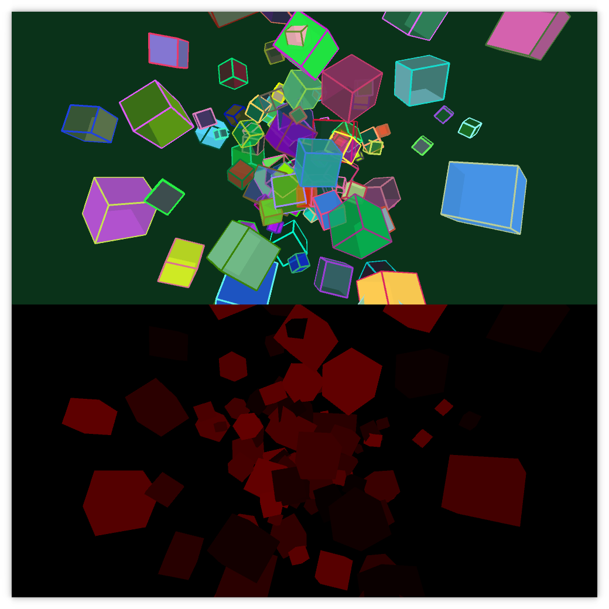
    <figcaption>[SceneBuffers nub example](https://github.com/nakednous/nub/blob/master/examples/basics/SceneBuffers/SceneBuffers.pde)</figcaption>
</figure>

V:

## Intro: Shader example

[Nub picking buffer fragment shader](https://github.com/nakednous/nub/blob/master/data/PickingBuffer.frag)

```glsl
uniform vec3 id;

void main() {
  gl_FragColor = vec4(id, 1.0);
}
```

V:

## Intro: Processing shader API: [PShader](https://processing.org/reference/PShader.html)

> Class that encapsulates a GLSL shader program, including a vertex and a fragment shader

V:

## Intro: Processing shader API: [loadShader()](https://processing.org/reference/loadShader_.html)

> Loads a shader into the PShader object

Method signatures

```processing
  loadShader(fragFilename)
  loadShader(fragFilename, vertFilename)
```
<!-- .element: class="fragment" data-fragment-index="1"-->

Example

```processing
  PShader unalShader;
  void setup() {
    ...
    //when no path is specified it looks in the sketch 'data' folder
    unalShader = loadShader("unal_frag.glsl", "unal_vert.glsl");
  }
```
<!-- .element: class="fragment" data-fragment-index="2"-->

V:

## Intro: Processing shader API: [shader()](https://processing.org/reference/shader_.html)

> Applies the specified shader

Method signature

```processing
  shader(shader)
```
<!-- .element: class="fragment" data-fragment-index="1"-->

Example

```processing
  PShader simpleShader, unalShader;
  void draw() {
    ...
    shader(simpleShader);
    simpleGeometry();
    shader(unalShader);
    unalGeometry();
  }
```
<!-- .element: class="fragment" data-fragment-index="2"-->

V:

## Intro: Processing shader API: [resetShader()](https://processing.org/reference/resetShader_.html)

> Restores the default shaders

Method signatures

```processing
  resetShader()
```
<!-- .element: class="fragment" data-fragment-index="1"-->

Example

```processing
  PShader simpleShader;
  void draw() {
    ...
    shader(simpleShader);
    simpleGeometry();
    resetshader();
    otherGeometry();
  }
```
<!-- .element: class="fragment" data-fragment-index="2"-->

V:

## Intro: Processing shader API: [PShader.set()](https://processing.org/reference/PShader_set_.html)

> Sets the uniform variables inside the shader to modify the effect while the program is running

Method signatures for vector uniform variables [vec2, vec3 or vec4](https://www.khronos.org/opengl/wiki/Data_Type_%28GLSL%29#Vectors):

```processing
  .set(name, x)
  .set(name, x, y)
  .set(name, x, y, z)
  .set(name, x, y, z, w)
  .set(name, vec)
```

* *name*: of the uniform variable to modify
* *x*, *y*, *z* and *w*: 1st, snd, 3rd and 4rd vec float components resp.
* *vec*: PVector

V:

## Intro: Processing shader API: [PShader.set()](https://processing.org/reference/PShader_set_.html)

> Sets the uniform variables inside the shader to modify the effect while the program is running

Method signatures for vector uniform variables [boolean[], float[], int[]](https://www.khronos.org/opengl/wiki/Data_Type_%28GLSL%29#Arrays):

```processing
  .set(name, x)
  .set(name, x, y)
  .set(name, x, y, z)
  .set(name, x, y, z, w)
  .set(name, vec)
```

* *name*: of the uniform variable to modify
* *x*, *y*, *z* and *w*: 1st, snd, 3rd and 4rd vec (boolean, float or int) components resp.
* *vec*: boolean[], float[], int[]

V:

## Intro: Processing shader API: [PShader.set()](https://processing.org/reference/PShader_set_.html)

> Sets the uniform variables inside the shader to modify the effect while the program is running

Method signatures for [mat3 and mat4](https://www.khronos.org/opengl/wiki/Data_Type_%28GLSL%29#Matrices) uniform variables:

```processing
  .set(name, mat) // mat is PMatrix2D, or PMatrix3D
```

* *name* of the uniform variable to modify
* *mat* PMatrix3D, or PMatrix2D

V:

## Intro: Shaders
### Processing shader API: [PShader.set()](https://processing.org/reference/PShader_set_.html)

> Sets the uniform variables inside the shader to modify the effect while the program is running

Method signatures for _texture_ uniform variables:

```processing
  .set(name, tex) // tex is a PImage
```

V:

## Intro: Processing shader API: [PShader.set()](https://processing.org/reference/PShader_set_.html)

> Sets the uniform variables inside the shader to modify the effect while the program is running

Example to set `mat4` uniform variables:

```processing
  PShader unalShader;
  PMatrix3D projectionModelView1, projectionModelView2;
  void draw() {
    ...
    shader(unalShader);
    unalShader.set("unalMatrix", projectionModelView1);
    unalGeometry1();
    unalShader.set("unalMatrix", projectionModelView2);
    unalGeometry2();
  }
```
<!-- .element: class="fragment" data-fragment-index="1"-->

H:

## Shader design patterns

1. Data sent from the sketch to the shaders<!-- .element: class="fragment" data-fragment-index="1"-->
2. Passing data among shaders<!-- .element: class="fragment" data-fragment-index="2"-->
3. Consistency of geometry operations<!-- .element: class="fragment" data-fragment-index="3"-->

V:

## Shader design patterns
### Pattern 1: Data sent from the sketch to the shaders

> Processing passes data to the shaders in a context sensitive way

<li class="fragment">Specific data (attribute and uniform vars) sent to the GPU depends on the specific Processing commands issued, e.g., ```fill(rgb) -> attribute vec4 color```
<li class="fragment">Several types of shader thus arise in Processing
<li class="fragment">More details are discussed in the _Shader Programming for Computational Arts and Design - A Comparison between Creative Coding Frameworks_ [paper](http://www.scitepress.org/DigitalLibrary/PublicationsDetail.aspx?ID=ysaclbloDHk=&t=1)

V:

## Shader design patterns
### Pattern 1: Data sent from the sketch to the shaders
#### (Frequently used) Attribute variables

| Processing methods    | Type   | Attribute                | Space     |
|-----------------------|:------:|:------------------------:|:---------:|
| `vertex()`            | `vec4` | `vertex` (or `position`) | _local_   |
| `normal()`, `shape()` | `vec3` | `normal`                 | _local_   |
| `vertex()`            | `vec2` | `texCoord`               | _texture_ |
| `stroke()`, `fill()`  | `vec4` | `color`                  | --        |

V:

## Shader design patterns
### Pattern 1: Data sent from the sketch to the shaders
#### (Frequently used) Uniform variables

| Processing methods                                                    | Type        | Uniform         |
|-----------------------------------------------------------------------|:-----------:|:---------------:|
| `orhto()`, `perspective()`                                            | `mat4`      | `projection`    |
| `applyMatrix()`, `translate()`,<br>  `rotate()`, `scale()`            | `mat4`      | `modelview`     |
| `applyMatrix()`, `translate()`,<br>  `rotate()`, `scale()`            | `mat3`      | `normalMatrix`  |

V:

## Shader design patterns
### Pattern 1: Data sent from the sketch to the shaders
#### (Frequently used) Uniform variables

| Processing methods                                                    | Type        | Uniform         | Space     |
|-----------------------------------------------------------------------|:-----------:|:---------------:|:---------:|
| `texture()`                                                           | `mat4`      | `texMatrix`     | --        |
| `texture()`                                                           | `sampler2D` | `texture`       | --        |
| `texture()`                                                           | `vec2`      | `texOffset`     | _texture_ |
| `lights()`, `ambientLight()`,<br> `spotLight()`, `directionalLight()` | `vec4`      | `lightPosition` | _eye_     |

V:

## Shader design patterns
### Pattern 1: Data sent from the sketch to the shaders

> Check the [code](https://github.com/processing/processing/tree/master/core/src/processing/opengl/shaders) to consult all the attribute and uniform variables sent to the shaders

V:

## Shader design patterns
### Pattern 2: Passing data among shaders

> Uniform variables are available for both, the vertex and the fragment shader. Attribute variables are only available to the vertex shader

<li class="fragment"> Passing a vertex *attribute* variable to the fragment shader thus requires relating it first to a vertex shader *varying* variable
<li class="fragment"> The vertex and fragment shaders would look like the following:
  ```glsl
  // vert.glsl
  attribute <type> var;
  varying <type> vert_var;
  void main() {
    ...
    vert_var = fx(var);
  }
  ```
  ```glsl
  // frag.glsl
  varying <type> vert_var;
  ```

V:

## Shader design patterns
### Pattern 2: Passing data among shaders
#### (Frequently used) Varying variables

| Processing methods    | Type   | Attribute  | Type   | Varying        |
|-----------------------|:------:|:----------:|:-------|:--------------:|
| `stroke()`, `fill()`  | `vec4` | `color`    | `vec4` | `vertColor`    |
| `vertex()`            | `vec2` | `texCoord` | `vec4` | `vertTexCoord` |

V:

## Shader design patterns
### Pattern 3: Consistency of geometry operations

> Geometry operation operands should be defined in the same coordinate system

<li class="fragment"> Tip 1: ```transform * vertex // projection * modelview * vertex``` yields the vertex coordinates in [clip-space](http://www.songho.ca/opengl/gl_transform.html)
<li class="fragment"> Tip 2: ```modelview * vertex``` yields the vertex coordinates in eye-space
<li class="fragment"> Tip 3: Since the eye position is 0 in eye-space, eye-space is the usual coordinate system for geometry operations 

H:

## The chow mein can

During the rest of this presentation we will work with the following test scene:

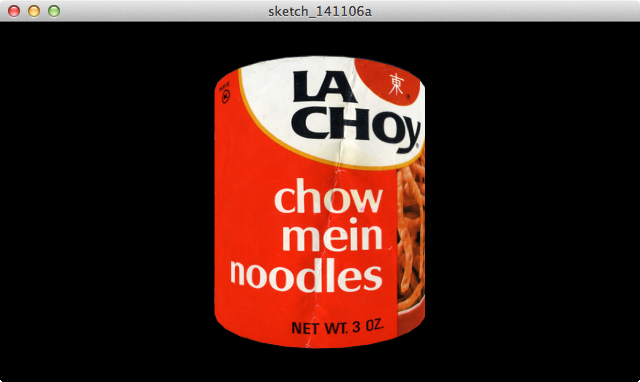

<li class="fragment"> We will be following the [Processing shader tutorial](https://processing.org/tutorials/pshader/) which source code is available [here](https://github.com/codeanticode/pshader-tutorials)

V:

## The chow mein can
### Code 

```java
PImage label;
PShape can;
float angle;

void setup() {
  size(640, 360, P3D);  
  label = loadImage("lachoy.jpg");
  can = createCan(100, 200, 32, label);
}

void draw() {    
  background(0);
  translate(width/2, height/2);
  rotateY(angle);  
  shape(can);  
  angle += 0.01;
}

PShape createCan(float r, float h, int detail, PImage tex) {
  textureMode(NORMAL);
  PShape sh = createShape();
  sh.beginShape(QUAD_STRIP);
  sh.noStroke();
  sh.texture(tex);
  for (int i = 0; i <= detail; i++) {
    float angle = TWO_PI / detail;
    float x = sin(i * angle);
    float z = cos(i * angle);
    float u = float(i) / detail;
    sh.normal(x, 0, z);
    sh.vertex(x * r, -h/2, z * r, u, 0);
    sh.vertex(x * r, +h/2, z * r, u, 1);    
  }
  sh.endShape(); 
  return sh;
}
```

V:

## The chow mein can
### Texture

<a href="fig/lachoy.jpg" target="_blank">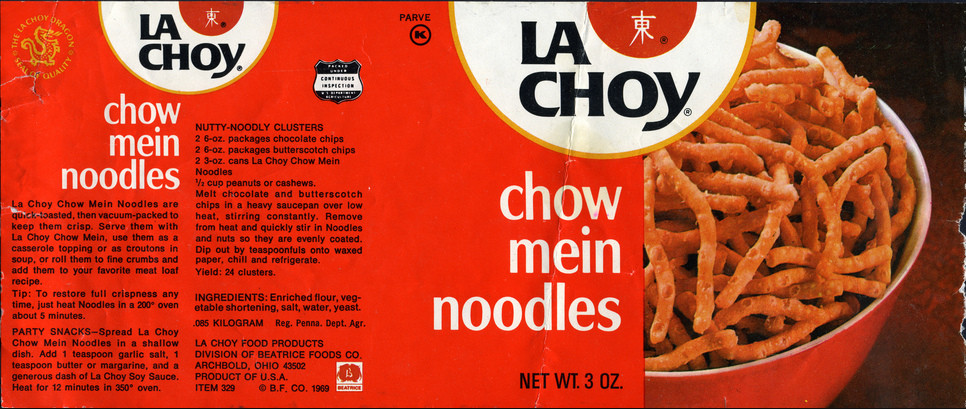</a>

(from Jason Liebig's <a href="http://www.flickr.com/photos/jasonliebigstuff/3739263136/in/photostream/" target="_blank">FLICKR collection</a> of vintage labels and wrappers)

H:

## Passive transformation shaders

<figure>
    
    <figcaption>Passive transformation shaders output (source code available [here](https://github.com/VisualComputing/Shaders/tree/gh-pages/sketches/desktop/PassiveTransformations))</figcaption>
</figure>

V:

## Passive transformation shaders: Design patterns

> Pattern 1: Data sent from the sketch to the shaders

([vert.glsl](https://github.com/VisualComputing/Shaders/blob/gh-pages/sketches/desktop/PassiveTransformations/data/vert.glsl) excerpt)
```glsl
...
uniform mat4 nub_transform;
attribute vec4 vertex;

void main() {
  gl_Position = nub_transform * vertex;
  ...
}
```

V:

## Passive transformation shaders: Design patterns
### [PassiveTransformations sketch](https://github.com/VisualComputing/Shaders/blob/gh-pages/sketches/desktop/PassiveTransformations/PassiveTransformations.pde)

A custom [MatrixHandler](https://visualcomputing.github.io/nub-javadocs/nub/core/MatrixHandler.html) is implemented to pass the nub `transform` matrix to a custom shader

```java
// excerpt of PassiveTransformations.pde

Graph graph;
Node[] nodes;
PShader shader;

void setup() {
  graph = new Graph(g, width, height);
  graph.setMatrixHandler(new MatrixHandler() {
    @Override
    protected void _setUniforms() {
      shader(shader);
      Scene.setUniform(shader, "nub_transform", transform());
    }
  });
  ...
  //discard Processing matrices
  resetMatrix();
  shader = loadShader("frag.glsl", "vert.glsl");
}

void draw() {
  background(0);
  // sets up the initial nub matrices according to user interaction
  graph.preDraw();
  graph.traverse();
}
```

H:

## Color shaders

<figure>
    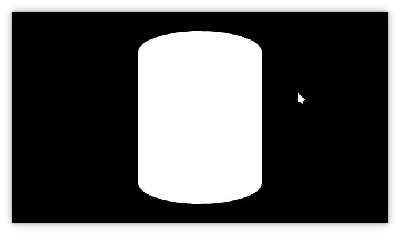
    <figcaption>Color shader output (source code available [here](https://github.com/codeanticode/pshader-tutorials/tree/master/intro/Ex_04_2_color))</figcaption>
</figure>

V:

## Color shaders: Design patterns

> Pattern 1: Data sent from the sketch to the shaders

([colorvert.glsl](https://github.com/codeanticode/pshader-tutorials/blob/master/intro/Ex_04_2_color/data/colorvert.glsl) excerpt)
```glsl
...
attribute vec4 color;
```

V:

## Color shaders: Design patterns

> Pattern 2: Passing data among shaders

([colorvert.glsl](https://github.com/codeanticode/pshader-tutorials/blob/master/intro/Ex_04_2_color/data/colorvert.glsl) excerpt)
```glsl
attribute vec4 color;
varying vec4 vertColor;
void main() {
  ...
  vertColor = color;
}
```
<!-- .element: class="fragment" data-fragment-index="1"-->

([colorfrag.glsl](https://github.com/codeanticode/pshader-tutorials/blob/master/intro/Ex_04_2_color/data/colorfrag.glsl) excerpt)
```glsl
varying vec4 vertColor;
void main() {
  gl_FragColor = vertColor;
}
```
<!-- .element: class="fragment" data-fragment-index="2"-->

H:

## Texture shaders
### Simple texture

<figure>
    
    <figcaption>Texture shader output (source code available [here](https://github.com/codeanticode/pshader-tutorials/tree/master/intro/Ex_05_1_texture))</figcaption>
</figure>

V:

## Texture shaders: Design patterns
### Simple texture

> Pattern 1: Data sent from the sketch to the shaders

```glsl
//excerpt from texvert.glsl
uniform mat4 texMatrix;
attribute vec2 texCoord;
```
<!-- .element: class="fragment" data-fragment-index="1"-->

```glsl
//excerpt from texfrag.glsl
uniform sampler2D texture;
...
```
<!-- .element: class="fragment" data-fragment-index="2"-->

V:

## Texture shaders: Design patterns
### Simple texture

> Pattern 2: Passing data among shaders

```glsl
//excerpt from texvert.glsl
uniform mat4 texMatrix;
attribute vec2 texCoord;
varying vec4 vertTexCoord;
void main() {
  ...
  vertTexCoord = texMatrix * vec4(texCoord, 1.0, 1.0);
}
```

> texMatrix rescales the texture coordinates (texCoord): inversion along the Y-axis, and non-power-of-two textures
<!-- .element: class="fragment" data-fragment-index="1"-->

V:

## Texture shaders: Design patterns
### Simple texture

> Pattern 2: Passing data among shaders

```glsl
//excerpt from texfrag.glsl
uniform sampler2D texture;
varying vec4 vertColor;
varying vec4 vertTexCoord;

void main() {
  gl_FragColor = texture2D(texture, vertTexCoord.st) * vertColor;
}
```

N:

The texture * vertColor product is consistent:
* vertColor is in [0..1]
* texture2D(texture, vertTexCoord.st) is also in [0..1]

V:

## Texture shaders
### Pixelation effect

<figure>
    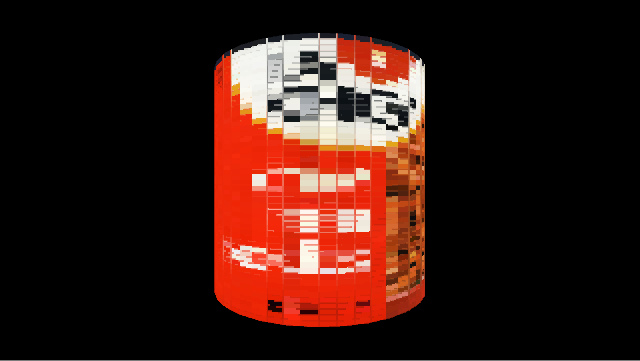
    <figcaption>Pixelation shader output (source code available [here](https://github.com/VisualComputing/Shaders/blob/gh-pages/sketches/desktop/Pixelator))</figcaption>
</figure>

V:

## Texture shaders
### Pixelation effect

We can sample the texels in virtually any way we want, and this allow us to create different types of effects

E.g., we can discretize the texture coords in the fragment shader as follows:
<!-- .element: class="fragment" data-fragment-index="1"-->

```glsl
uniform sampler2D texture;

varying vec4 vertColor;
varying vec4 vertTexCoord;

void main() {
  int si = int(vertTexCoord.s * 50.0);
  int sj = int(vertTexCoord.t * 50.0);  
  gl_FragColor = texture2D(texture, vec2(float(si) / 50.0, float(sj) / 50.0)) * vertColor;  
}
```
<!-- .element: class="fragment" data-fragment-index="1"-->

V:

## Texture shaders
### Pixelation effect

The constant 50 can be converted into an *uniform* variable (```binsize```):

```java
//Pixelator.pde
PImage label;
PShape can;
float angle;

PShader pixelator;

void setup() {
  size(640, 360, P3D);  
  label = loadImage("lachoy.jpg");
  can = createCan(100, 200, 32, label);
  pixelator = loadShader("pixel.glsl");
}

void draw() {    
  background(0);

  pixelator.set("binsize", 100.0 * float(mouseX) / width);
  shader(pixelator);
    
  translate(width/2, height/2);
  rotateY(angle);  
  shape(can);  
  angle += 0.01;
}

PShape createCan(float r, float h, int detail, PImage tex) {
  textureMode(NORMAL);
  PShape sh = createShape();
  sh.beginShape(QUAD_STRIP);
  sh.noStroke();
  sh.texture(tex);
  for (int i = 0; i <= detail; i++) {
    float angle = TWO_PI / detail;
    float x = sin(i * angle);
    float z = cos(i * angle);
    float u = float(i) / detail;
    sh.normal(x, 0, z);
    sh.vertex(x * r, -h/2, z * r, u, 0);
    sh.vertex(x * r, +h/2, z * r, u, 1);    
  }
  sh.endShape(); 
  return sh;
}
```

V:

## Texture shaders
### Pixelation effect

```glsl
//pixel.glsl
uniform sampler2D texture;

varying vec4 vertColor;
varying vec4 vertTexCoord;

uniform float binsize;

void main() {
  int si = int(vertTexCoord.s * binsize);
  int sj = int(vertTexCoord.t * binsize);  
  gl_FragColor = texture2D(texture, vec2(float(si) / binsize, float(sj) / binsize)) * vertColor;  
}
```

H:

## Light shaders
### Simple lighting models

Simple lighting models of a 3D scene involves at least:

1. (optionally) Taking into account ambient light
2. Placing one or more light sources in the space
3. Defining their parameters, such as type (point, spotlight) and color (diffuse, specular)

Assumption: light source that light equally in all directions
<!-- .element: class="fragment" data-fragment-index="1"-->

V:

## Light shaders
### Lighting parameters: diffuse light

<figure>
    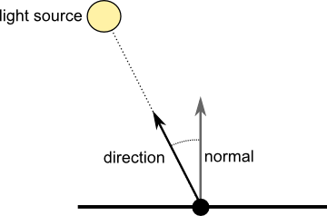
    <figcaption>Diffuse light: `$I = direction \bullet normal$`</figcaption>
</figure>

V:

## Light shaders
### Lighting parameters: diffuse light

<figure>
    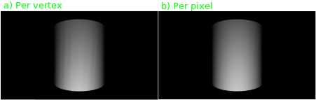
    <figcaption>Diffuse light: `$I = direction \bullet normal$`</figcaption>
</figure>

V:

## Light shaders
### Lighting parameters: per vertex diffuse light

<figure>
    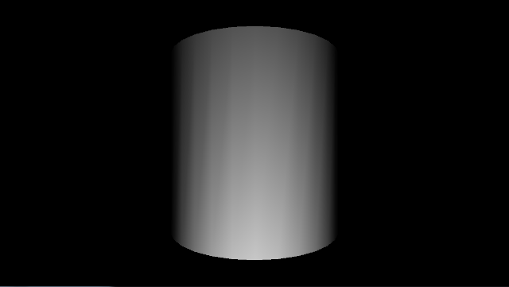
    <figcaption>Per vertex diffuse light shader output (source code available [here](https://github.com/codeanticode/pshader-tutorials/blob/master/intro/Ex_06_1_light/))</figcaption>
</figure>

V:

## Light shaders: Design patterns
### Lighting parameters: per vertex diffuse light

> Pattern 1: Data sent from the sketch to the shaders

```glsl
//excerpt from lightvert.glsl
uniform mat4 modelview;
uniform mat3 normalMatrix;
uniform vec4 lightPosition;

attribute vec4 position;
attribute vec4 color;
attribute vec3 normal;
```

V:

## Light shaders: Design patterns
### Lighting parameters: per vertex diffuse light
#### Observation about the [normal matrix](http://www.lighthouse3d.com/tutorials/glsl-12-tutorial/the-normal-matrix/)

Let $M$ be $ModelView(4;4)$ (i.e., it is formed by deleting row and column 4 from the ModelView)

> Multiplying the input ```normal``` vector by the ```normalMatrix```, i.e., `$({M^{-1})}^T$`, yields its coordinates in the eye-space

V:

## Light shaders: Design patterns
### Lighting parameters: per vertex diffuse light
#### Observation about the [normal matrix](http://www.lighthouse3d.com/tutorials/glsl-12-tutorial/the-normal-matrix/)

Why not use ```modelview``` matrix, instead of ```normalMatrix``` (`$({M^{-1})}^T$`)?

<figure>
    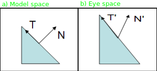
    <figcaption>`$N * modelview$` when the matrix contains a non-uniform scale</figcaption>
</figure>
<!-- .element: class="fragment" data-fragment-index="1"-->

V:

## Light shaders: Design patterns
### Lighting parameters: per vertex diffuse light

> Pattern 2: Passing data among shaders

> Pattern 3: Consistency of geometry operations

```glsl
//excerpt from lightvert.glsl
uniform vec4 lightPosition;
varying vec4 vertColor;

void main() {
  ...
  vec3 ecPosition = vec3(modelview * position);//eye coordinate system
  vec3 ecNormal = normalize(normalMatrix * normal);//eye coordinate system
  vec3 direction = normalize(lightPosition.xyz - ecPosition);//Pattern 3   
  float intensity = max(0.0, dot(direction, ecNormal));//Pattern 3
  vertColor = vec4(intensity, intensity, intensity, 1) * color;
}
```

V:

## Light shaders: Design patterns
### Lighting parameters: per vertex diffuse light

> Pattern 2: Passing data among shaders

```glsl
//lightfrag.glsl
varying vec4 vertColor;

void main() {
  gl_FragColor = vertColor;
}
```

V:

## Light shaders
### Lighting parameters: per pixel diffuse light

<figure>
    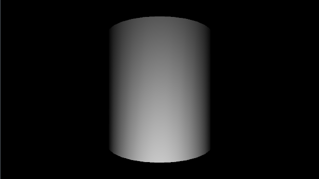
    <figcaption>Per pixel diffuse light shader output (source code available [here](https://github.com/codeanticode/pshader-tutorials/blob/master/intro/Ex_06_2_pixlight/))</figcaption>
</figure>

V:

## Light shaders: Design patterns
### Lighting parameters: per pixel diffuse light

> Pattern 1: Data sent from the sketch to the shaders

```glsl
//excerpt from pixlightvert.glsl
uniform mat4 modelview;
uniform mat3 normalMatrix;
uniform vec4 lightPosition;

attribute vec4 position;
attribute vec4 color;
attribute vec3 normal;
```

V:

## Light shaders: Design patterns
### Lighting parameters: per pixel diffuse light

> Pattern 2: Passing data among shaders

> Pattern 3: Consistency of geometry operations

```glsl
//excerpt from pixlightvert.glsl
varying vec4 vertColor;
varying vec3 ecNormal;
varying vec3 lightDir;

void main() {
  ...
  vec3 ecPosition = vec3(modelview * position);
  ecNormal = normalize(normalMatrix * normal);
  lightDir = normalize(lightPosition.xyz - ecPosition);//Pattern 3
  vertColor = color;
}
```

V:

## Light shaders: Design patterns
### Lighting parameters: per pixel diffuse light

> Pattern 2: Passing data among shaders

> Pattern 3: Consistency of geometry operations

```glsl
//pixlightfrag.glsl
varying vec4 vertColor;
varying vec3 ecNormal;
varying vec3 lightDir;

void main() {  
  vec3 direction = normalize(lightDir);
  vec3 normal = normalize(ecNormal);
  float intensity = max(0.0, dot(direction, normal));//Pattern 3
  gl_FragColor = vec4(intensity, intensity, intensity, 1) * vertColor;
}
```

V:

## Light shaders
### Lighting params: specular light ([Phong model](https://en.wikipedia.org/wiki/Phong_reflection_model))

<figure>
    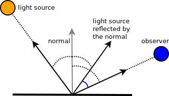
    <figcaption>Specular light: `$I = direction_{reflected} \bullet observer$`</figcaption>
</figure>

V:

## Light shaders
### Lighting parameters: specular light

<figure>
    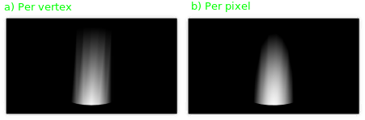
    <figcaption>Specular light: `$I = direction_{reflected} \bullet observer$`</figcaption>
</figure>

V:

## Light shaders
### Lighting parameters: per vertex specular light

<figure>
    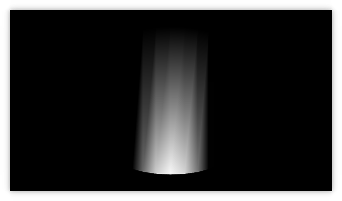
    <figcaption>Per vertex specular light shader output (source code available [here](https://github.com/VisualComputing/Shaders/tree/gh-pages/sketches/desktop/Specular))</figcaption>
</figure>

V:

## Light shaders
### Lighting parameters: per vertex specular light

> Identifying the per vertex specular shader design patterns is left as an excercise to the reader

V:

## Light shaders
### Lighting parameters: per pixel specular light

<figure>
    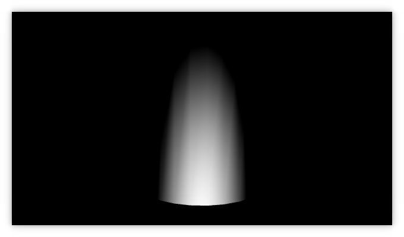
    <figcaption>Per pixel specular light shader output (source code available [here](https://github.com/VisualComputing/Shaders/tree/gh-pages/sketches/desktop/PixSpecular))</figcaption>
</figure>

V:

## Light shaders
### Lighting parameters: per pixel specular light

> Identifying the per pixel specular shader design patterns is left as an excercise to the reader

V:

## Light shaders
### Suggested workshop

> Simple lighting and material

Tasks

1. Combine all the simple lighting models using per-vertex and per-pixel shaders
2. Use up to 8 lights in the model
3. Implement other simple light model such as [normal mapping]() or [Warn lights](https://books.google.com.co/books?id=pCwwxlMuNycC&pg=PA113&lpg=PA113&dq=shader+warn+light+model&source=bl&ots=vVu814VVAU&sig=nKGlD6fpT6pl5U1GUcdhIJxEQQQ&hl=en&sa=X&ved=0ahUKEwipp_bQ9e3TAhVEPiYKHS5wC3wQ6AEIJTAA#v=onepage&q=shader%20warn%20light%20model&f=false)

H:

## Convolution filters
### Overview

<figure>
    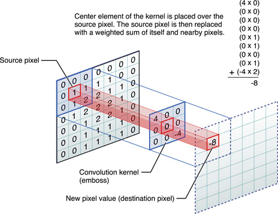
    <figcaption>Convolution kernel (courtesy of [apple](https://developer.apple.com/library/content/documentation/Performance/Conceptual/vImage/ConvolutionOperations/ConvolutionOperations.html))</figcaption>
</figure>

V:

## Convolution filters: Design patterns

> Pattern 2: Passing data among shaders

```glsl
//excerpt from fragment shader
varying vec4 vertColor;
varying vec4 vertTexCoord;
...
```

There's no need to override the vertex shader, becasuse the default one will emit the needed varying variables
<!-- .element: class="fragment" data-fragment-index="1"-->

V:

## Convolution filters: Design patterns

> Pattern 1: Data sent from the sketch to the shaders

```glsl
//excerpt from fragment shader
uniform sampler2D texture;
uniform vec2 texOffset;
varying vec4 vertColor;//Pattern 2
varying vec4 vertTexCoord;//Pattern 2
...
```

<li class="fragment"> Given the texture coordinates of a fragment (```vertTexCoord```), the neighboring texels can be sampled using ```texOffset``` (```= vec2(1/width, 1/height```)
<li class="fragment"> For example:
```glsl
vertTexCoord.st + vec2(texOffset.s, 0)
```
is the texel exactly one position to the right

V:

## Convolution filters: Edge detection

<figure>
    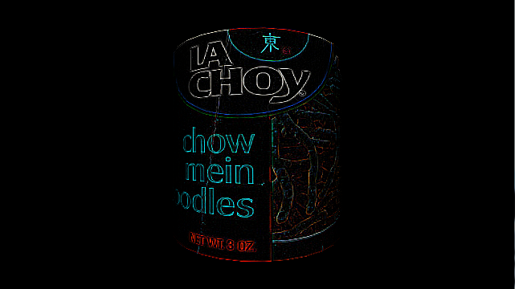
    <figcaption>Edge detection filter (source code available [here](https://github.com/codeanticode/pshader-tutorials/tree/master/intro/Ex_08_2_edges))</figcaption>
</figure>

V:

## Convolution filters: Edge detection
### Convolution kernel

`$\begin{bmatrix}
-1 & -1 & -1 \cr
-1 & 8  & -1 \cr
-1 & -1 & -1 \cr
\end{bmatrix}$`

V:

## Convolution filters: Edge detection
### Shader

```glsl
uniform sampler2D texture;
uniform vec2 texOffset;

varying vec4 vertColor;
varying vec4 vertTexCoord;

const vec4 lumcoeff = vec4(0.299, 0.587, 0.114, 0);

void main() {
  vec2 tc0 = vertTexCoord.st + vec2(-texOffset.s, -texOffset.t);
  vec2 tc1 = vertTexCoord.st + vec2(         0.0, -texOffset.t);
  vec2 tc2 = vertTexCoord.st + vec2(+texOffset.s, -texOffset.t);
  vec2 tc3 = vertTexCoord.st + vec2(-texOffset.s,          0.0);
  vec2 tc4 = vertTexCoord.st + vec2(         0.0,          0.0);
  vec2 tc5 = vertTexCoord.st + vec2(+texOffset.s,          0.0);
  vec2 tc6 = vertTexCoord.st + vec2(-texOffset.s, +texOffset.t);
  vec2 tc7 = vertTexCoord.st + vec2(         0.0, +texOffset.t);
  vec2 tc8 = vertTexCoord.st + vec2(+texOffset.s, +texOffset.t);
  
  vec4 col0 = texture2D(texture, tc0);
  vec4 col1 = texture2D(texture, tc1);
  vec4 col2 = texture2D(texture, tc2);
  vec4 col3 = texture2D(texture, tc3);
  vec4 col4 = texture2D(texture, tc4);
  vec4 col5 = texture2D(texture, tc5);
  vec4 col6 = texture2D(texture, tc6);
  vec4 col7 = texture2D(texture, tc7);
  vec4 col8 = texture2D(texture, tc8);

  vec4 sum = 8.0 * col4 - (col0 + col1 + col2 + col3 + col5 + col6 + col7 + col8); 
  gl_FragColor = vec4(sum.rgb, 1.0) * vertColor; 
}
```

V:

## Convolution filters: Sharpen

<figure>
    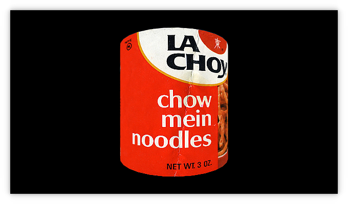
    <figcaption>Sharpen filter (source code available [here](https://github.com/VisualComputing/Shaders/tree/gh-pages/sketches/desktop/Sharpen))</figcaption>
</figure>

V:

## Convolution filters: Sharpen
### Convolution kernel

`$\begin{bmatrix}
 0  & -1 &  0 \cr
-1  &  5 & -1 \cr
 0  & -1 &  0 \cr
\end{bmatrix}$`

V:

## Convolution filters: Sharpen
### Shader

```glsl
uniform sampler2D texture;
uniform vec2 texOffset;

varying vec4 vertColor;
varying vec4 vertTexCoord;

void main() {
  vec2 tc0 = vertTexCoord.st + vec2(-texOffset.s, -texOffset.t);
  vec2 tc1 = vertTexCoord.st + vec2(         0.0, -texOffset.t);
  vec2 tc2 = vertTexCoord.st + vec2(+texOffset.s, -texOffset.t);
  vec2 tc3 = vertTexCoord.st + vec2(-texOffset.s,          0.0);
  vec2 tc4 = vertTexCoord.st + vec2(         0.0,          0.0);
  vec2 tc5 = vertTexCoord.st + vec2(+texOffset.s,          0.0);
  vec2 tc6 = vertTexCoord.st + vec2(-texOffset.s, +texOffset.t);
  vec2 tc7 = vertTexCoord.st + vec2(         0.0, +texOffset.t);
  vec2 tc8 = vertTexCoord.st + vec2(+texOffset.s, +texOffset.t);
  
  vec4 col0 = texture2D(texture, tc0);
  vec4 col1 = texture2D(texture, tc1);
  vec4 col2 = texture2D(texture, tc2);
  vec4 col3 = texture2D(texture, tc3);
  vec4 col4 = texture2D(texture, tc4);
  vec4 col5 = texture2D(texture, tc5);
  vec4 col6 = texture2D(texture, tc6);
  vec4 col7 = texture2D(texture, tc7);
  vec4 col8 = texture2D(texture, tc8);

  vec4 sum = - (col1 + col3 + col5 + col7) + 5 * col4;
  
  gl_FragColor = vec4(sum.rgb, 1.0) * vertColor;
}
```

V:

## Convolution filters
### Suggested workshop

> Convolution filters

Tasks

1. Support some common [convolution kernels](https://en.wikipedia.org/wiki/Kernel_(image_processing) using fragment shaders
2. Allow customization of convolution kernels
3. Filter both image and video files

Idea for a project: use the [(fast) Fourier transform](http://lodev.org/cgtutor/filtering.html) to fast apply the filters

H:

## Screen filters
### Using fragment shaders

To apply any of the image post-processing effects to an arbitrary
Processing sketch call ```filter(PShader shader)``` after your drawing

For example, to apply the [sharpen shader as a screen filter](https://github.com/VisualComputing/Shaders/tree/gh-pages/sketches/desktop/ScreenFilter):

```java
PShader sharpen;

void setup() {
  size(400, 400, P3D); 
  sharpen = loadShader("sharpen.glsl");  
}

void draw() {
  background(150);
  lights();
  translate(width/2, height/2);
  rotateX(frameCount * 0.01);
  rotateY(frameCount * 0.01);
  box(100);

  filter(sharpen);
}
```

H:

## Shadertoy

[Shadertoy shaders](https://www.shadertoy.com/) are purely procedural: no geometry is sent from the main application,
and all the scene is generated in the fragment shader:

<a href="https://www.shadertoy.com/view/MdX3Rr" target="_blank">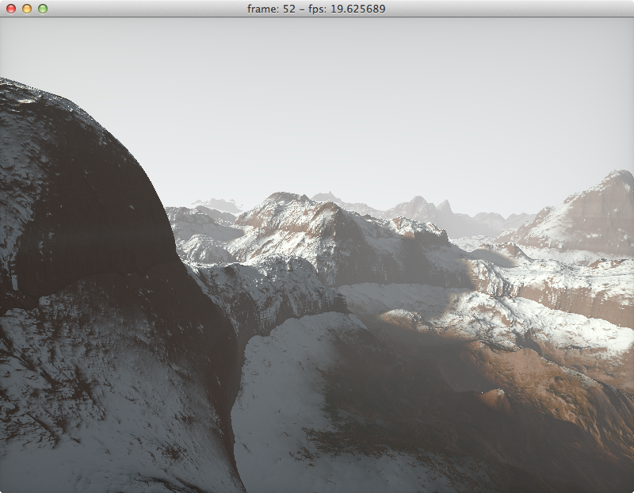</a>

V:

## Shadertoy
### Running Shadertoy shaders in Processing

These shaders can be easily run in Processing by defining a layer between Processing and Shadertoy uniforms:

```glsl
// Processing specific input
uniform float time;
uniform vec2 resolution;
uniform vec2 mouse;

// Layer between Processing and Shadertoy uniforms
vec3 iResolution = vec3(resolution,0.0);
float iGlobalTime = time;
vec4 iMouse = vec4(mouse,0.0,0.0); // zw would normally be the click status

// ------- Below is the unmodified Shadertoy code ----------
// Created by inigo quilez - iq/2013
// License Creative Commons Attribution-NonCommercial-ShareAlike 3.0 Unported License.

//stereo thanks to Croqueteer
//#define STEREO 

mat3 m = mat3( 0.00,  0.80,  0.60,
              -0.80,  0.36, -0.48,
              -0.60, -0.48,  0.64 );

float hash( float n )
{
    return fract(sin(n)*43758.5453123);
}

float noise( in vec3 x )
{
    vec3 p = floor(x);
    vec3 f = fract(x);

    f = f*f*(3.0-2.0*f);

    float n = p.x + p.y*57.0 + 113.0*p.z;

    float res = mix(mix(mix( hash(n+  0.0), hash(n+  1.0),f.x),
                        mix( hash(n+ 57.0), hash(n+ 58.0),f.x),f.y),
                    mix(mix( hash(n+113.0), hash(n+114.0),f.x),
                        mix( hash(n+170.0), hash(n+171.0),f.x),f.y),f.z);
    return res;
}

vec3 noised( in vec2 x )
{
    vec2 p = floor(x);
    vec2 f = fract(x);

    vec2 u = f*f*(3.0-2.0*f);

    float n = p.x + p.y*57.0;

    float a = hash(n+  0.0);
    float b = hash(n+  1.0);
    float c = hash(n+ 57.0);
    float d = hash(n+ 58.0);
	return vec3(a+(b-a)*u.x+(c-a)*u.y+(a-b-c+d)*u.x*u.y,
				30.0*f*f*(f*(f-2.0)+1.0)*(vec2(b-a,c-a)+(a-b-c+d)*u.yx));

}

float noise( in vec2 x )
{
    vec2 p = floor(x);
    vec2 f = fract(x);

    f = f*f*(3.0-2.0*f);

    float n = p.x + p.y*57.0;

    float res = mix(mix( hash(n+  0.0), hash(n+  1.0),f.x),
                    mix( hash(n+ 57.0), hash(n+ 58.0),f.x),f.y);

    return res;
}

float fbm( vec3 p )
{
    float f = 0.0;

    f += 0.5000*noise( p ); p = m*p*2.02;
    f += 0.2500*noise( p ); p = m*p*2.03;
    f += 0.1250*noise( p ); p = m*p*2.01;
    f += 0.0625*noise( p );

    return f/0.9375;
}

mat2 m2 = mat2(1.6,-1.2,1.2,1.6);
	
float fbm( vec2 p )
{
    float f = 0.0;

    f += 0.5000*noise( p ); p = m2*p*2.02;
    f += 0.2500*noise( p ); p = m2*p*2.03;
    f += 0.1250*noise( p ); p = m2*p*2.01;
    f += 0.0625*noise( p );

    return f/0.9375;
}

float terrain( in vec2 x )
{
	vec2  p = x*0.003;
    float a = 0.0;
    float b = 1.0;
	vec2  d = vec2(0.0);
    for(int i=0;i<5; i++)
    {
        vec3 n = noised(p);
        d += n.yz;
        a += b*n.x/(1.0+dot(d,d));
		b *= 0.5;
        p=mat2(1.6,-1.2,1.2,1.6)*p;
    }

    return 140.0*a;
}

float terrain2( in vec2 x )
{
	vec2  p = x*0.003;
    float a = 0.0;
    float b = 1.0;
	vec2  d = vec2(0.0);
    for(int i=0;i<14; i++)
    {
        vec3 n = noised(p);
        d += n.yz;
        a += b*n.x/(1.0+dot(d,d));
		b *= 0.5;
        p=m2*p;
    }

    return 140.0*a;
}

float map( in vec3 p )
{
	float h = terrain(p.xz);
	
	float ss = 0.03;
	float hh = h*ss;
	float fh = fract(hh);
	float ih = floor(hh);
	fh = mix( sqrt(fh), fh, smoothstep(50.0,140.0,h) );
	h = (ih+fh)/ss;
	
    return p.y - h;
}

float map2( in vec3 p )
{
	float h = terrain2(p.xz);

	
	float ss = 0.03;
	float hh = h*ss;
	float fh = fract(hh);
	float ih = floor(hh);
	fh = mix( sqrt(fh), fh, smoothstep(50.0,140.0,h) );
	h = (ih+fh)/ss;
	
    return p.y - h;
}

bool jinteresct(in vec3 rO, in vec3 rD, out float resT )
{
    float h = 0.0;
    float t = 0.0;
	for( int j=0; j<120; j++ )
	{
        //if( t>2000.0 ) break;
		
	    vec3 p = rO + t*rD;
if( p.y>300.0 ) break;
        h = map( p );

		if( h<0.1 )
		{
			resT = t; 
			return true;
		}
		t += max(0.1,0.5*h);

	}

	if( h<5.0 )
    {
	    resT = t;
	    return true;
	}
	return false;
}

float sinteresct(in vec3 rO, in vec3 rD )
{
    float res = 1.0;
    float t = 0.0;
	for( int j=0; j<50; j++ )
	{
        //if( t>1000.0 ) break;
	    vec3 p = rO + t*rD;

        float h = map( p );

		if( h<0.1 )
		{
			return 0.0;
		}
		res = min( res, 16.0*h/t );
		t += h;

	}

	return clamp( res, 0.0, 1.0 );
}

vec3 calcNormal( in vec3 pos, float t )
{
	float e = 0.001;
	e = 0.001*t;
    vec3  eps = vec3(e,0.0,0.0);
    vec3 nor;
    nor.x = map2(pos+eps.xyy) - map2(pos-eps.xyy);
    nor.y = map2(pos+eps.yxy) - map2(pos-eps.yxy);
    nor.z = map2(pos+eps.yyx) - map2(pos-eps.yyx);
    return normalize(nor);
}

vec3 camPath( float time )
{
    vec2 p = 600.0*vec2( cos(1.4+0.37*time), 
                         cos(3.2+0.31*time) );

	return vec3( p.x, 0.0, p.y );
}

void main(void)
{
    vec2 xy = -1.0 + 2.0*gl_FragCoord.xy / iResolution.xy;

	vec2 s = xy*vec2(1.75,1.0);

	#ifdef STEREO
	float isCyan = mod(gl_FragCoord.x + mod(gl_FragCoord.y,2.0),2.0);
    #endif
	
    float time = iGlobalTime*.15;

	vec3 light1 = normalize( vec3(  0.4, 0.22,  0.6 ) );
	vec3 light2 = vec3( -0.707, 0.000, -0.707 );

	vec3 campos = camPath( time );
	vec3 camtar = camPath( time + 3.0 );
	campos.y = terrain( campos.xz ) + 15.0;
	camtar.y = campos.y*0.5;

	float roll = 0.1*cos(0.1*time);
	vec3 cw = normalize(camtar-campos);
	vec3 cp = vec3(sin(roll), cos(roll),0.0);
	vec3 cu = normalize(cross(cw,cp));
	vec3 cv = normalize(cross(cu,cw));
	vec3 rd = normalize( s.x*cu + s.y*cv + 1.6*cw );

	#ifdef STEREO
	campos += 2.0*cu*isCyan; // move camera to the right - the rd vector is still good
    #endif

	float sundot = clamp(dot(rd,light1),0.0,1.0);
	vec3 col;
    float t;
    if( !jinteresct(campos,rd,t) )
    {
     	col = 0.9*vec3(0.97,.99,1.0)*(1.0-0.3*rd.y);
		col += 0.2*vec3(0.8,0.7,0.5)*pow( sundot, 4.0 );
	}
	else
	{
		vec3 pos = campos + t*rd;

        vec3 nor = calcNormal( pos, t );

		float dif1 = clamp( dot( light1, nor ), 0.0, 1.0 );
		float dif2 = clamp( 0.2 + 0.8*dot( light2, nor ), 0.0, 1.0 );
		float sh = 1.0;
		if( dif1>0.001 ) 
			sh = sinteresct(pos+light1*20.0,light1);
		
		vec3 dif1v = vec3(dif1);
		dif1v *= vec3( sh, sh*sh*0.5+0.5*sh, sh*sh );

		float r = noise( 7.0*pos.xz );

        col = (r*0.25+0.75)*0.9*mix( vec3(0.10,0.05,0.03), vec3(0.13,0.10,0.08), clamp(terrain2( vec2(pos.x,pos.y*48.0))/200.0,0.0,1.0) );
		col = mix( col, 0.17*vec3(0.5,.23,0.04)*(0.50+0.50*r),smoothstep(0.70,0.9,nor.y) );
        col = mix( col, 0.10*vec3(0.2,.30,0.00)*(0.25+0.75*r),smoothstep(0.95,1.0,nor.y) );
  	    col *= 0.75;
         // snow
        #if 1
		float h = smoothstep(55.0,80.0,pos.y + 25.0*fbm(0.01*pos.xz) );
        float e = smoothstep(1.0-0.5*h,1.0-0.1*h,nor.y);
        float o = 0.3 + 0.7*smoothstep(0.0,0.1,nor.x+h*h);
        float s = h*e*o;
        s = smoothstep( 0.1, 0.9, s );
        col = mix( col, 0.4*vec3(0.6,0.65,0.7), s );
        #endif
		
		vec3 brdf  = 2.0*vec3(0.17,0.19,0.20)*clamp(nor.y,0.0,1.0);
		     brdf += 6.0*vec3(1.00,0.95,0.80)*dif1v;
		     brdf += 2.0*vec3(0.20,0.20,0.20)*dif2;

		col *= brdf;
		
		float fo = 1.0-exp(-pow(0.0015*t,1.5));
		vec3 fco = vec3(0.7) + 0.6*vec3(0.8,0.7,0.5)*pow( sundot, 4.0 );
		col = mix( col, fco, fo );
	}

	col = sqrt(col);

	vec2 uv = xy*0.5+0.5;
	col *= 0.7 + 0.3*pow(16.0*uv.x*uv.y*(1.0-uv.x)*(1.0-uv.y),0.1);
	
    #ifdef STEREO	
    col *= vec3( isCyan, 1.0-isCyan, 1.0-isCyan );	
	#endif
	
	gl_FragColor=vec4(col,1.0);
}
```

V:

## Shadertoy
### Running Shadertoy shaders in Processing

The sketch code is very simple, just the uniform setting and a rect covering the entire window (this way all the screen pixels will pass through the fragment shader):

```java
PShader shader;

void setup() {
  size(640, 360, P2D);
  noStroke();
  shader = loadShader("landscape.glsl");
  shader.set("resolution", float(width), float(height));   
}

void draw() {
  background(0);
    
  shader.set("time", (float)(millis()/1000.0));
  shader(shader); 
  rect(0, 0, width, height);
}
```

H:

## Shaderbase
### Creating and sharing shaders

<li class="fragment"> This is an on-going [collaboration](https://github.com/remixlab/shaderbase)
<li class="fragment"> The goal is to create a Processing tool that allows users to upload shaders to a github-based db

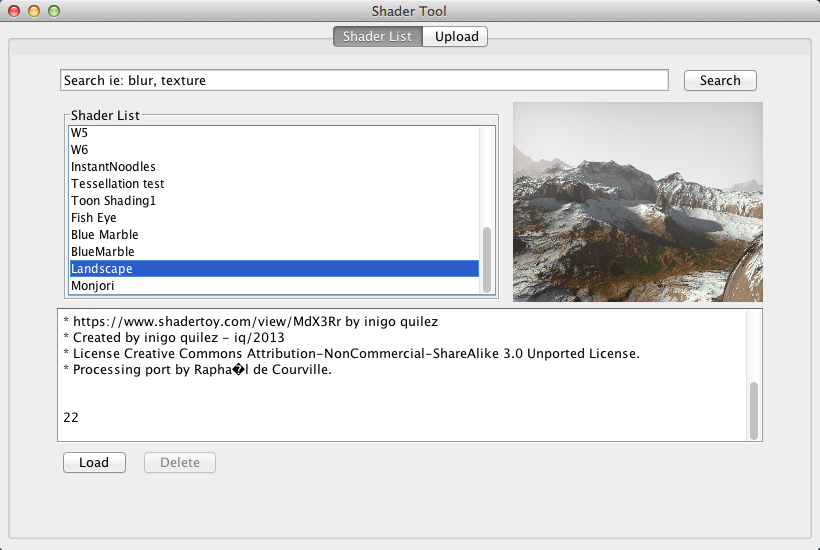

H:

## References

* [OpenGL Shading Language](https://www.khronos.org/opengl/wiki/OpenGL_Shading_Language)
* [Data Type (GLSL)](https://www.khronos.org/opengl/wiki/Data_Type_%28GLSL%29)
* [The Book of Shaders, by Patricio Gonzalez Vivo](http://patriciogonzalezvivo.com/2015/thebookofshaders/)
* [Processing shaders tutorial](https://www.processing.org/tutorials/pshader/)
* [Tutorial source code](https://github.com/codeanticode/pshader-tutorials)
* [Shader Programming for Computational Arts and Design - A Comparison between Creative Coding Frameworks](http://www.scitepress.org/DigitalLibrary/PublicationsDetail.aspx?ID=ysaclbloDHk=&t=1)
* [ShaderBase: A Processing Tool for Shaders in Computational Arts and Design](http://www.scitepress.org/DigitalLibrary/Link.aspx?doi=10.5220/0005673201890194) (source code [available here](https://github.com/remixlab/shaderbase))
