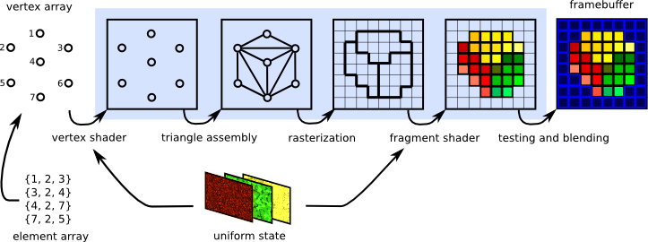

<section id="themes">
	<h2>Themes</h2>
		<p>
			Set your presentation theme: <br>
			<!-- Hacks to swap themes after the page has loaded. Not flexible and only intended for the reveal.js demo deck. -->
                        <a href="#" onclick="document.getElementById('theme').setAttribute('href','css/theme/black.css'); return false;">Black (default)</a> -
			<a href="#" onclick="document.getElementById('theme').setAttribute('href','css/theme/white.css'); return false;">White</a> -
			<a href="#" onclick="document.getElementById('theme').setAttribute('href','css/theme/league.css'); return false;">League</a> -
			<a href="#" onclick="document.getElementById('theme').setAttribute('href','css/theme/sky.css'); return false;">Sky</a> -
			<a href="#" onclick="document.getElementById('theme').setAttribute('href','css/theme/beige.css'); return false;">Beige</a> -
			<a href="#" onclick="document.getElementById('theme').setAttribute('href','css/theme/simple.css'); return false;">Simple</a> <br>
			<a href="#" onclick="document.getElementById('theme').setAttribute('href','css/theme/serif.css'); return false;">Serif</a> -
			<a href="#" onclick="document.getElementById('theme').setAttribute('href','css/theme/blood.css'); return false;">Blood</a> -
			<a href="#" onclick="document.getElementById('theme').setAttribute('href','css/theme/night.css'); return false;">Night</a> -
			<a href="#" onclick="document.getElementById('theme').setAttribute('href','css/theme/moon.css'); return false;">Moon</a> -
			<a href="#" onclick="document.getElementById('theme').setAttribute('href','css/theme/solarized.css'); return false;">Solarized</a>
		</p>
</section>

H:

## SHADERS IN PROCESSING

Yesid Ochoa & Oscar Gomez & Diego Garcia

H:

## Contents

1. Introducción
<!-- .element: class="fragment" data-fragment-index="1"-->
2. Patrones de diseño de shaders
<!-- .element: class="fragment" data-fragment-index="1"-->
3. The chow mein can
<!-- .element: class="fragment" data-fragment-index="1"-->
4. Filtros de convolución
<!-- .element: class="fragment" data-fragment-index="1"-->


H:

## ¿Qué es un shader?

<li class="fragment">Un shader es un programa que se ejecuta en la GPU (Graphics Processing Unit) <br> y es controlado por nuestra aplicación. (por ejemplo, un sketch en Processing )</li>
<li class="fragment">El lenguage de los shaders en Processing es GLSL (OpenGL Shading Language)</li>

V:

## El canal de gráficos

<div class="ulist">
    
    <ul style="width: 30%;">
        <p class="fragment" data-fragment-index="1">Vertex shader</p>
        <p class="fragment" data-fragment-index="2">Fragment shader</p>
    </ul>
</div>

V:

## Ejecución Shaders GPU 

El vertex shader se ejecuta en *cada vertice* enviado desde el sketch:

```python
for vertex in geometry:
    vertex_shader(vertex)
```

El fragment shader se ejecuta en *cada pixel* cubierto por la geometria en nuestro sketch:

```python
for pixel in screen:
    if covered_by_geometry(pixel):
        ouptut_color = fragment_shader(pixel)
```

V:

## Tipos de variables Shader

<li class="fragment">*Uniform* variables son aquellas que permanecen constantes para cada vértice en la escena, <br> por ejemplo las matrices _projection_ y _modelview_.</li>
<li class="fragment">*Attribute* variables se definen para cada vértice, por ejemplo _posicion_, _normal_, y _color_.</li>
<li class="fragment">*Varying* variables  permiten relacionar un atributo de vértice con un fragmento, mediante interpolación.</li>

N:

* varying variables get interpolated between the vertex and the fragment shader

V:

## Processing shader API: [PShader](https://processing.org/reference/PShader.html)

> Clase que encapsula un programa de sombreado GLSL, incluyendo un vertex shader y un fragment shader

V:

## Processing shader API: [loadShader()](https://processing.org/reference/loadShader_.html)

> Carga un shader en el objeto PShader

Method signatures

```processing
  loadShader(fragFilename)
  loadShader(fragFilename, vertFilename)
```
<!-- .element: class="fragment" data-fragment-index="1"-->

Ejemplo

```processing
  PShader unalShader;
  void setup() {
    ...
    //when no path is specified it looks in the sketch 'data' folder
    unalShader = loadShader("unal_frag.glsl", "unal_vert.glsl");
  }
```
<!-- .element: class="fragment" data-fragment-index="2"-->

V:

## Processing shader API: [shader()](https://processing.org/reference/shader_.html)

>Aplica el shader especificado.

Method signature

```processing
  shader(shader)
```
<!-- .element: class="fragment" data-fragment-index="1"-->

Ejemplo

```processing
  PShader simpleShader, unalShader;
  void draw() {
    ...
    shader(simpleShader);
    simpleGeometry();
    shader(unalShader);
    unalGeometry();
  }
```
<!-- .element: class="fragment" data-fragment-index="2"-->

V:

## Processing shader API: [resetShader()](https://processing.org/reference/resetShader_.html)

> Restaura los shaders predeterminados.

Method signatures

```processing
  resetShader()
```
<!-- .element: class="fragment" data-fragment-index="1"-->

Ejemplo

```processing
  PShader simpleShader;
  void draw() {
    ...
    shader(simpleShader);
    simpleGeometry();
    resetshader();
    otherGeometry();
  }
```
<!-- .element: class="fragment" data-fragment-index="2"-->

V:

## Processing shader API: [PShader.set()](https://processing.org/reference/PShader_set_.html)

> Establece las variables uniform dentro del shaders para modificar el efecto mientras el programa se está ejecutando.
	
Method signatures para variables uniformes vectoriales [vec2, vec3 o vec4](https://www.khronos.org/opengl/wiki/Data_Type_%28GLSL%29#Vectors):

```processing
  .set(name, x)
  .set(name, x, y)
  .set(name, x, y, z)
  .set(name, x, y, z, w)
  .set(name, vec)
```

* *name*: de la variable uniforme a modificar
* *x*, *y*, *z* and *w*: 1st, 2nd, 3rd and 4rd vec float components resp.
* *vec*: PVector

V:

## Processing shader API: [PShader.set()](https://processing.org/reference/PShader_set_.html)

> Establece las variables uniform dentro del shaders para modificar el efecto mientras el programa se está ejecutando.

Method signaturespara variables uniformes vectoriales [boolean[], float[], int[]](https://www.khronos.org/opengl/wiki/Data_Type_%28GLSL%29#Arrays):

```processing
  .set(name, x)
  .set(name, x, y)
  .set(name, x, y, z)
  .set(name, x, y, z, w)
  .set(name, vec)
```

* *name*: de la variable uniforme a modificar
* *x*, *y*, *z* y *w*: 1st, 2nd, 3rd and 4rd vec (boolean, float or int) components resp.
* *vec*: boolean[], float[], int[]

V:

## Processing shader API: [PShader.set()](https://processing.org/reference/PShader_set_.html)

> Establece las variables uniform dentro del shaders para modificar el efecto mientras el programa se está ejecutando.

Method signatures para [mat3 y mat4](https://www.khronos.org/opengl/wiki/Data_Type_%28GLSL%29#Matrices) uniform variables:

```processing
  .set(name, mat) // mat is PMatrix2D, or PMatrix3D
```

* *name* de la variable uniforme a modificar
* *mat* PMatrix3D, o PMatrix2D

V:

## Shaders
### Processing shader API: [PShader.set()](https://processing.org/reference/PShader_set_.html)

> Establece las variables uniform dentro del shaders para modificar el efecto mientras el programa se está ejecutando.

Method signatures para variable _texture_ uniform:

```processing
  .set(name, tex) // tex is a PImage
```

V:

## Processing shader API: [PShader.set()](https://processing.org/reference/PShader_set_.html)

> Establece las variables uniform dentro del shaders para modificar el efecto mientras el programa se está ejecutando.

Ejemplo para establecer variable uniform `mat4`:

```processing
  PShader unalShader;
  PMatrix3D projectionModelView1, projectionModelView2;
  void draw() {
    ...
    shader(unalShader);
    unalShader.set("unalMatrix", projectionModelView1);
    unalGeometry1();
    unalShader.set("unalMatrix", projectionModelView2);
    unalGeometry2();
  }
```
<!-- .element: class="fragment" data-fragment-index="1"-->

H:

## Patrones de diseño de shaders

1. Datos enviados desde el sketch a los shaders. <!-- .element: class="fragment" data-fragment-index="1"-->
2. Pasando datos entre los shaders. <!-- .element: class="fragment" data-fragment-index="1"-->

V:

## Patrones de diseño de shaders
### Patrón 1: Datos enviados desde el sketch a los shaders

> El procesamiento pasa los datos a los shaders de una manera sensible al contexto.

<li class="fragment"> Los datos específicos (variables attribute y uniform ) enviadas a la GPU dependen de los comandos de Processing específicos emitidos, por ejemplo, <br> ```fill(rgb) -> attribute vec4 color```
<li class="fragment"> Varios tipos de shader surgen en Processing
<li class="fragment"> Más detalles se discuten en el [paper](http://www.scitepress.org/DigitalLibrary/PublicationsDetail.aspx?ID=ysaclbloDHk=&t=1) _Shader Programming for Computational Arts and Design - A Comparison between Creative Coding Frameworks_

V:

## Patrones de diseño de shaders
### Patrón 1: Datos enviados desde el sketch a los shaders
#### (Frecuentemente usado) Variables de atributos

| Processing methods    | Type   | Attribute                | Space     |
|-----------------------|:------:|:------------------------:|:---------:|
| `vertex()`            | `vec4` | `vertex` (or `position`) | _local_   |
| `normal()`, `shape()` | `vec3` | `normal`                 | _local_   |
| `vertex()`            | `vec2` | `texCoord`               | _texture_ |
| `stroke()`, `fill()`  | `vec4` | `color`                  | --        |

V:

## Patrones de diseño de shaders
### Patrón 1: Datos enviados desde el sketch a los shaders
#### (Frecuentemente usado) Variables de atributos

| Processing methods                                                    | Type        | Uniform         |
|-----------------------------------------------------------------------|:-----------:|:---------------:|
| `orhto()`, `perspective()`                                            | `mat4`      | `projection`    |
| `applyMatrix()`, `translate()`,<br>  `rotate()`, `scale()`            | `mat4`      | `modelview`     |
| `applyMatrix()`, `translate()`,<br>  `rotate()`, `scale()`            | `mat3`      | `normalMatrix`  |

V:

## Patrones de diseño de shaders
### Patrón 1: Datos enviados desde el sketch a los shaders
#### (Frecuentemente usado) Variables de atributos

| Processing methods                                                    | Type        | Uniform         | Space     |
|-----------------------------------------------------------------------|:-----------:|:---------------:|:---------:|
| `texture()`                                                           | `mat4`      | `texMatrix`     | --        |
| `texture()`                                                           | `sampler2D` | `texture`       | --        |
| `texture()`                                                           | `vec2`      | `texOffset`     | _texture_ |
| `lights()`, `ambientLight()`,<br> `spotLight()`, `directionalLight()` | `vec4`      | `lightPosition` | _eye_     |

V:

## Patrones de diseño de shaders
### Patrón 1: Datos enviados desde el sketch a los shaders

> Verifique el [codigo](https://github.com/processing/processing/tree/master/core/src/processing/opengl/shaders) para consultar todas las variables attribute y uniform enviadas a los shaders

V:

## Patrones de diseño de shaders
### Patrón 2: Pasando datos entre los shaders

> Las variables uniform están disponibles para ambos, el vertex y el fragment shader. Las variables attribute solo están disponibles para el vertex shader

<li class="fragment"> Pasar una variable *attribute* de vertex a el fragment shader requiere, por lo tanto, relacionarla primero con una variable *varying* de vertex shader 
<li class="fragment"> El vertex shader y el fragment shader se verían como los siguientes:
  ```glsl
  // vert.glsl
  attribute <type> var;
  varying <type> vert_var;
  void main() {
    ...
    vert_var = fx(var);
  }
  ```
  ```glsl
  // frag.glsl
  varying <type> vert_var;
  ```

V:

## Patrones de diseño de shaders
### Patrón 2: Pasando datos entre los shaders
#### (Frecuentemente usado) Variables Varying 

| Processing methods    | Type   | Attribute  | Type   | Varying        |
|-----------------------|:------:|:----------:|:-------|:--------------:|
| `stroke()`, `fill()`  | `vec4` | `color`    | `vec4` | `vertColor`    |
| `vertex()`            | `vec2` | `texCoord` | `vec4` | `vertTexCoord` |


H:

## The chow mein can

During the rest of this presentation we will work with the following test scene:


<li class="fragment"> We will be following the [Processing shader tutorial](https://processing.org/tutorials/pshader/) which source code is available [here](https://github.com/codeanticode/pshader-tutorials)

V:

## The chow mein can
### Code 

```java
PImage label;
PShape can;
float angle;

void setup() {
  size(640, 360, P3D);  
  label = loadImage("lachoy.jpg");
  can = createCan(100, 200, 32, label);
}

void draw() {    
  background(0);
  translate(width/2, height/2);
  rotateY(angle);  
  shape(can);  
  angle += 0.01;
}

PShape createCan(float r, float h, int detail, PImage tex) {
  textureMode(NORMAL);
  PShape sh = createShape();
  sh.beginShape(QUAD_STRIP);
  sh.noStroke();
  sh.texture(tex);
  for (int i = 0; i <= detail; i++) {
    float angle = TWO_PI / detail;
    float x = sin(i * angle);
    float z = cos(i * angle);
    float u = float(i) / detail;
    sh.normal(x, 0, z);
    sh.vertex(x * r, -h/2, z * r, u, 0);
    sh.vertex(x * r, +h/2, z * r, u, 1);    
  }
  sh.endShape(); 
  return sh;
}
```

V:

## The chow mein can
### Texture

<a href="fig/lachoy.jpg" target="_blank"></a>

(from Jason Liebig's <a href="http://www.flickr.com/photos/jasonliebigstuff/3739263136/in/photostream/" target="_blank">FLICKR collection</a> of vintage labels and wrappers)

H:

## Filtros de convolución
### Overview

<figure>
    
    <figcaption>Convolution kernel (courtesy of [apple](https://developer.apple.com/library/content/documentation/Performance/Conceptual/vImage/ConvolutionOperations/ConvolutionOperations.html))</figcaption>
</figure>

V:

## Filtros de convolución: Patrones de diseño

> Patron 2: Pasando datos entre los shaders

```glsl
//excerpt from fragment shader
varying vec4 vertColor;
varying vec4 vertTexCoord;
...
```

No es necesario sobreescribir el vertex shader, ya que el predeterminado emitirá las variables varying.
<!-- .element: class="fragment" data-fragment-index="1"-->

V:

## Filtros de convolución: Patrones de diseño

> Patrón 1: Datos enviados desde el sketch a los shaders

```glsl
//excerpt from fragment shader
uniform sampler2D texture;
uniform vec2 texOffset;
varying vec4 vertColor;//Pattern 2
varying vec4 vertTexCoord;//Pattern 2
...
```

<li class="fragment"> Given the texture coordinates of a fragment (```vertTexCoord```), the neighboring texels can be sampled using ```texOffset``` (```= vec2(1/width, 1/height```)
<li class="fragment"> For example:
```glsl
vertTexCoord.st + vec2(texOffset.s, 0)
```
is the texel exactly one position to the right

V:

## Filtros de convolución: Deteccion de bordes

<figure>
    
    <figcaption>Filtro de deteccion de bordes (source code available [here](https://github.com/codeanticode/pshader-tutorials/tree/master/intro/Ex_08_2_edges))</figcaption>
</figure>

V:

## Filtros de convolución: Deteccion de bordes
### Convolution kernel

`$\begin{bmatrix}
-1 & -1 & -1 \cr
-1 & 8  & -1 \cr
-1 & -1 & -1 \cr
\end{bmatrix}$`

V:

## Filtros de convolución: Deteccion de bordes
### Shader

```glsl
uniform sampler2D texture;
uniform vec2 texOffset;

varying vec4 vertColor;
varying vec4 vertTexCoord;

const vec4 lumcoeff = vec4(0.299, 0.587, 0.114, 0);

void main() {
  vec2 tc0 = vertTexCoord.st + vec2(-texOffset.s, -texOffset.t);
  vec2 tc1 = vertTexCoord.st + vec2(         0.0, -texOffset.t);
  vec2 tc2 = vertTexCoord.st + vec2(+texOffset.s, -texOffset.t);
  vec2 tc3 = vertTexCoord.st + vec2(-texOffset.s,          0.0);
  vec2 tc4 = vertTexCoord.st + vec2(         0.0,          0.0);
  vec2 tc5 = vertTexCoord.st + vec2(+texOffset.s,          0.0);
  vec2 tc6 = vertTexCoord.st + vec2(-texOffset.s, +texOffset.t);
  vec2 tc7 = vertTexCoord.st + vec2(         0.0, +texOffset.t);
  vec2 tc8 = vertTexCoord.st + vec2(+texOffset.s, +texOffset.t);
  
  vec4 col0 = texture2D(texture, tc0);
  vec4 col1 = texture2D(texture, tc1);
  vec4 col2 = texture2D(texture, tc2);
  vec4 col3 = texture2D(texture, tc3);
  vec4 col4 = texture2D(texture, tc4);
  vec4 col5 = texture2D(texture, tc5);
  vec4 col6 = texture2D(texture, tc6);
  vec4 col7 = texture2D(texture, tc7);
  vec4 col8 = texture2D(texture, tc8);

  vec4 sum = 8.0 * col4 - (col0 + col1 + col2 + col3 + col5 + col6 + col7 + col8); 
  gl_FragColor = vec4(sum.rgb, 1.0) * vertColor; 
}
```

V:

## Filtros de convolución: Sharpen

<figure>
    
    <figcaption>Sharpen filter (source code available [here](https://github.com/VisualComputing/Shaders/tree/gh-pages/sketches/desktop/Sharpen))</figcaption>
</figure>

V:

## Filtros de convolución: Sharpen
### Convolution kernel

`$\begin{bmatrix}
 0  & -1 &  0 \cr
-1  &  5 & -1 \cr
 0  & -1 &  0 \cr
\end{bmatrix}$`

V:

## Filtros de convolución: Sharpen
### Shader

```glsl
uniform sampler2D texture;
uniform vec2 texOffset;

varying vec4 vertColor;
varying vec4 vertTexCoord;

void main() {
  vec2 tc0 = vertTexCoord.st + vec2(-texOffset.s, -texOffset.t);
  vec2 tc1 = vertTexCoord.st + vec2(         0.0, -texOffset.t);
  vec2 tc2 = vertTexCoord.st + vec2(+texOffset.s, -texOffset.t);
  vec2 tc3 = vertTexCoord.st + vec2(-texOffset.s,          0.0);
  vec2 tc4 = vertTexCoord.st + vec2(         0.0,          0.0);
  vec2 tc5 = vertTexCoord.st + vec2(+texOffset.s,          0.0);
  vec2 tc6 = vertTexCoord.st + vec2(-texOffset.s, +texOffset.t);
  vec2 tc7 = vertTexCoord.st + vec2(         0.0, +texOffset.t);
  vec2 tc8 = vertTexCoord.st + vec2(+texOffset.s, +texOffset.t);
  
  vec4 col0 = texture2D(texture, tc0);
  vec4 col1 = texture2D(texture, tc1);
  vec4 col2 = texture2D(texture, tc2);
  vec4 col3 = texture2D(texture, tc3);
  vec4 col4 = texture2D(texture, tc4);
  vec4 col5 = texture2D(texture, tc5);
  vec4 col6 = texture2D(texture, tc6);
  vec4 col7 = texture2D(texture, tc7);
  vec4 col8 = texture2D(texture, tc8);

  vec4 sum = - (col1 + col3 + col5 + col7) + 5 * col4;
  
  gl_FragColor = vec4(sum.rgb, 1.0) * vertColor;
}
```

V:

## Filtros de convolución

> Filtros de convolución


1. Soportar algunos [nucleos de convolucion](https://en.wikipedia.org/wiki/Kernel_(image_processing) usando fragment shaders
2. Permitir la personalización de los núcleos de convolución.
3. Filtrar archivos de imagen y video


H:

## References

* [OpenGL Shading Language](https://www.khronos.org/opengl/wiki/OpenGL_Shading_Language)
* [Data Type (GLSL)](https://www.khronos.org/opengl/wiki/Data_Type_%28GLSL%29)
* [The Book of Shaders, by Patricio Gonzalez Vivo](http://patriciogonzalezvivo.com/2015/thebookofshaders/)
* [Processing shaders tutorial](https://www.processing.org/tutorials/pshader/)
* [Tutorial source code](https://github.com/codeanticode/pshader-tutorials)
* [Shader Programming for Computational Arts and Design - A Comparison between Creative Coding Frameworks](http://www.scitepress.org/DigitalLibrary/PublicationsDetail.aspx?ID=ysaclbloDHk=&t=1)
* [ShaderBase: A Processing Tool for Shaders in Computational Arts and Design](http://www.scitepress.org/DigitalLibrary/Link.aspx?doi=10.5220/0005673201890194) (source code [available here](https://github.com/remixlab/shaderbase))
