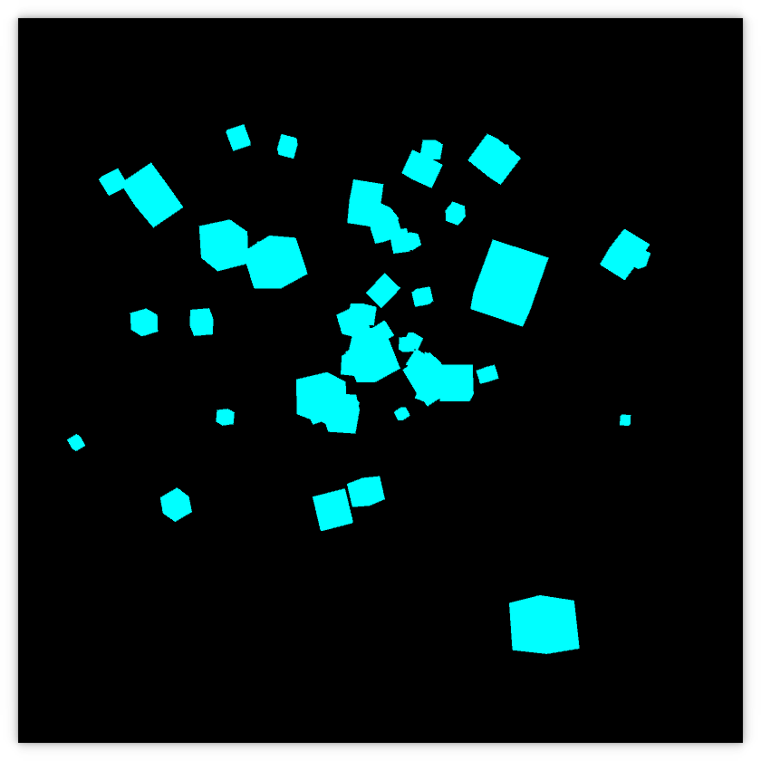

<section id="themes">
	<h2>Themes</h2>
		<p>
			Set your presentation theme: <br>
			<!-- Hacks to swap themes after the page has loaded. Not flexible and only intended for the reveal.js demo deck. -->
                        <a href="#" onclick="document.getElementById('theme').setAttribute('href','css/theme/black.css'); return false;">Black (default)</a> -
			<a href="#" onclick="document.getElementById('theme').setAttribute('href','css/theme/white.css'); return false;">White</a> -
			<a href="#" onclick="document.getElementById('theme').setAttribute('href','css/theme/league.css'); return false;">League</a> -
			<a href="#" onclick="document.getElementById('theme').setAttribute('href','css/theme/sky.css'); return false;">Sky</a> -
			<a href="#" onclick="document.getElementById('theme').setAttribute('href','css/theme/beige.css'); return false;">Beige</a> -
			<a href="#" onclick="document.getElementById('theme').setAttribute('href','css/theme/simple.css'); return false;">Simple</a> <br>
			<a href="#" onclick="document.getElementById('theme').setAttribute('href','css/theme/serif.css'); return false;">Serif</a> -
			<a href="#" onclick="document.getElementById('theme').setAttribute('href','css/theme/blood.css'); return false;">Blood</a> -
			<a href="#" onclick="document.getElementById('theme').setAttribute('href','css/theme/night.css'); return false;">Night</a> -
			<a href="#" onclick="document.getElementById('theme').setAttribute('href','css/theme/moon.css'); return false;">Moon</a> -
			<a href="#" onclick="document.getElementById('theme').setAttribute('href','css/theme/solarized.css'); return false;">Solarized</a>
		</p>
</section>

H:

## SHADERS IN PROCESSING

Yesid Ochoa & Oscar Gomez & Diego Garcia

H:

## Contents

1. Introducción
<!-- .element: class="fragment" data-fragment-index="1"-->
2. Patrones de diseño de shaders
<!-- .element: class="fragment" data-fragment-index="1"-->
3. The chow mein can
<!-- .element: class="fragment" data-fragment-index="1"-->
4. Shaders de transformación pasiva
<!-- .element: class="fragment" data-fragment-index="2"-->
5. Color shaders
<!-- .element: class="fragment" data-fragment-index="2"-->
6. Texture shaders
<!-- .element: class="fragment" data-fragment-index="2"-->
7. Light shaders
<!-- .element: class="fragment" data-fragment-index="2"-->
8. Filtros de convolución
<!-- .element: class="fragment" data-fragment-index="2"-->
9. Filtros de pantalla
<!-- .element: class="fragment" data-fragment-index="3"-->


H:

## ¿Qué es un shader?

<li class="fragment">Un shader es un programa que se ejecuta en la GPU (Graphics Processing Unit) <br> y es controlado por nuestra aplicación. (por ejemplo, un sketch en Processing )</li>
<li class="fragment">El lenguage de los shaders en Processing es GLSL (OpenGL Shading Language)</li>

V:

## El canal de gráficos

<div class="ulist">
    
    <ul style="width: 30%;">
        <p class="fragment" data-fragment-index="1">Vertex shader</p>
        <p class="fragment" data-fragment-index="2">Fragment shader</p>
    </ul>
</div>

V:

## Ejecución Shaders GPU 

El vertex shader se ejecuta en *cada vertice* enviado desde el sketch:

```python
for vertex in geometry:
    vertex_shader(vertex)
```

El fragment shader se ejecuta en *cada pixel* cubierto por la geometria en nuestro sketch:

```python
for pixel in screen:
    if covered_by_geometry(pixel):
        ouptut_color = fragment_shader(pixel)
```

V:

## Tipos de variables Shader

<li class="fragment">*Uniform* variables son aquellas que permanecen constantes para cada vértice en la escena, <br> por ejemplo las matrices _projection_ y _modelview_.</li>
<li class="fragment">*Attribute* variables se definen para cada vértice, por ejemplo _posicion_, _normal_, y _color_.</li>
<li class="fragment">*Varying* variables  permiten relacionar un atributo de vértice con un fragmento, mediante interpolación.</li>

N:

* varying variables get interpolated between the vertex and the fragment shader

V:

## Processing shader API: [PShader](https://processing.org/reference/PShader.html)

> Clase que encapsula un programa de sombreado GLSL, incluyendo un vertex shader y un fragment shader

V:

## Processing shader API: [loadShader()](https://processing.org/reference/loadShader_.html)

> Carga un shader en el objeto PShader

Method signatures

```processing
  loadShader(fragFilename)
  loadShader(fragFilename, vertFilename)
```
<!-- .element: class="fragment" data-fragment-index="1"-->

Ejemplo

```processing
  PShader unalShader;
  void setup() {
    ...
    //when no path is specified it looks in the sketch 'data' folder
    unalShader = loadShader("unal_frag.glsl", "unal_vert.glsl");
  }
```
<!-- .element: class="fragment" data-fragment-index="2"-->

V:

## Processing shader API: [shader()](https://processing.org/reference/shader_.html)

>Aplica el shader especificado.

Method signature

```processing
  shader(shader)
```
<!-- .element: class="fragment" data-fragment-index="1"-->

Ejemplo

```processing
  PShader simpleShader, unalShader;
  void draw() {
    ...
    shader(simpleShader);
    simpleGeometry();
    shader(unalShader);
    unalGeometry();
  }
```
<!-- .element: class="fragment" data-fragment-index="2"-->

V:

## Processing shader API: [resetShader()](https://processing.org/reference/resetShader_.html)

> Restaura los shaders predeterminados.

Method signatures

```processing
  resetShader()
```
<!-- .element: class="fragment" data-fragment-index="1"-->

Ejemplo

```processing
  PShader simpleShader;
  void draw() {
    ...
    shader(simpleShader);
    simpleGeometry();
    resetshader();
    otherGeometry();
  }
```
<!-- .element: class="fragment" data-fragment-index="2"-->

V:

## Processing shader API: [PShader.set()](https://processing.org/reference/PShader_set_.html)

> Establece las variables uniform dentro del shaders para modificar el efecto mientras el programa se está ejecutando.
	
Method signatures para variables uniformes vectoriales [vec2, vec3 o vec4](https://www.khronos.org/opengl/wiki/Data_Type_%28GLSL%29#Vectors):

```processing
  .set(name, x)
  .set(name, x, y)
  .set(name, x, y, z)
  .set(name, x, y, z, w)
  .set(name, vec)
```

* *name*: de la variable uniforme a modificar
* *x*, *y*, *z* and *w*: 1st, 2nd, 3rd and 4rd vec float components resp.
* *vec*: PVector

V:

## Processing shader API: [PShader.set()](https://processing.org/reference/PShader_set_.html)

> Establece las variables uniform dentro del shaders para modificar el efecto mientras el programa se está ejecutando.

Method signaturespara variables uniformes vectoriales [boolean[], float[], int[]](https://www.khronos.org/opengl/wiki/Data_Type_%28GLSL%29#Arrays):

```processing
  .set(name, x)
  .set(name, x, y)
  .set(name, x, y, z)
  .set(name, x, y, z, w)
  .set(name, vec)
```

* *name*: de la variable uniforme a modificar
* *x*, *y*, *z* y *w*: 1st, 2nd, 3rd and 4rd vec (boolean, float or int) components resp.
* *vec*: boolean[], float[], int[]

V:

## Processing shader API: [PShader.set()](https://processing.org/reference/PShader_set_.html)

> Establece las variables uniform dentro del shaders para modificar el efecto mientras el programa se está ejecutando.

Method signatures para [mat3 y mat4](https://www.khronos.org/opengl/wiki/Data_Type_%28GLSL%29#Matrices) uniform variables:

```processing
  .set(name, mat) // mat is PMatrix2D, or PMatrix3D
```

* *name* de la variable uniforme a modificar
* *mat* PMatrix3D, o PMatrix2D

V:

## Shaders
### Processing shader API: [PShader.set()](https://processing.org/reference/PShader_set_.html)

> Establece las variables uniform dentro del shaders para modificar el efecto mientras el programa se está ejecutando.

Method signatures para variable _texture_ uniform:

```processing
  .set(name, tex) // tex is a PImage
```

V:

## Processing shader API: [PShader.set()](https://processing.org/reference/PShader_set_.html)

> Establece las variables uniform dentro del shaders para modificar el efecto mientras el programa se está ejecutando.

Ejemplo para establecer variable uniform `mat4`:

```processing
  PShader unalShader;
  PMatrix3D projectionModelView1, projectionModelView2;
  void draw() {
    ...
    shader(unalShader);
    unalShader.set("unalMatrix", projectionModelView1);
    unalGeometry1();
    unalShader.set("unalMatrix", projectionModelView2);
    unalGeometry2();
  }
```
<!-- .element: class="fragment" data-fragment-index="1"-->

H:

## Patrones de diseño de shaders

1. Datos enviados desde el sketch a los shaders. <!-- .element: class="fragment" data-fragment-index="1"-->
2. Pasando datos entre los shaders. <!-- .element: class="fragment" data-fragment-index="2"-->

V:

## Patrones de diseño de shaders
### Patrón 1: Datos enviados desde el sketch a los shaders

> El procesamiento pasa los datos a los shaders de una manera sensible al contexto.

<li class="fragment"> Los datos específicos (variables attribute y uniform ) enviadas a la GPU dependen de los comandos de Processing específicos emitidos, por ejemplo, <br> ```fill(rgb) -> attribute vec4 color```
<li class="fragment"> Varios tipos de shader surgen en Processing
<li class="fragment"> Más detalles se discuten en el [paper](http://www.scitepress.org/DigitalLibrary/PublicationsDetail.aspx?ID=ysaclbloDHk=&t=1) _Shader Programming for Computational Arts and Design - A Comparison between Creative Coding Frameworks_

V:

## Patrones de diseño de shaders
### Patrón 1: Datos enviados desde el sketch a los shaders
#### (Frecuentemente usado) Variables de atributos

| Processing methods    | Type   | Attribute                | Space     |
|-----------------------|:------:|:------------------------:|:---------:|
| `vertex()`            | `vec4` | `vertex` (or `position`) | _local_   |
| `normal()`, `shape()` | `vec3` | `normal`                 | _local_   |
| `vertex()`            | `vec2` | `texCoord`               | _texture_ |
| `stroke()`, `fill()`  | `vec4` | `color`                  | --        |

V:

## Patrones de diseño de shaders
### Patrón 1: Datos enviados desde el sketch a los shaders
#### (Frecuentemente usado) Variables de atributos

| Processing methods                                                    | Type        | Uniform         |
|-----------------------------------------------------------------------|:-----------:|:---------------:|
| `orhto()`, `perspective()`                                            | `mat4`      | `projection`    |
| `applyMatrix()`, `translate()`,<br>  `rotate()`, `scale()`            | `mat4`      | `modelview`     |
| `applyMatrix()`, `translate()`,<br>  `rotate()`, `scale()`            | `mat3`      | `normalMatrix`  |

V:

## Patrones de diseño de shaders
### Patrón 1: Datos enviados desde el sketch a los shaders
#### (Frecuentemente usado) Variables de atributos

| Processing methods                                                    | Type        | Uniform         | Space     |
|-----------------------------------------------------------------------|:-----------:|:---------------:|:---------:|
| `texture()`                                                           | `mat4`      | `texMatrix`     | --        |
| `texture()`                                                           | `sampler2D` | `texture`       | --        |
| `texture()`                                                           | `vec2`      | `texOffset`     | _texture_ |
| `lights()`, `ambientLight()`,<br> `spotLight()`, `directionalLight()` | `vec4`      | `lightPosition` | _eye_     |

V:

## Patrones de diseño de shaders
### Patrón 1: Datos enviados desde el sketch a los shaders

> Verifique el [codigo](https://github.com/processing/processing/tree/master/core/src/processing/opengl/shaders) para consultar todas las variables attribute y uniform enviadas a los shaders

V:

## Patrones de diseño de shaders
### Patrón 2: Pasando datos entre los shaders

> Las variables uniform están disponibles para ambos, el vertex y el fragment shader. Las variables attribute solo están disponibles para el vertex shader

<li class="fragment"> Pasar una variable *attribute* de vertex a el fragment shader requiere, por lo tanto, relacionarla primero con una variable *varying* de vertex shader 
<li class="fragment"> El vertex shader y el fragment shader se verían como los siguientes:
  ```glsl
  // vert.glsl
  attribute <type> var;
  varying <type> vert_var;
  void main() {
    ...
    vert_var = fx(var);
  }
  ```
  ```glsl
  // frag.glsl
  varying <type> vert_var;
  ```

V:

## Patrones de diseño de shaders
### Patrón 2: Pasando datos entre los shaders
#### (Frecuentemente usado) Variables Varying 

| Processing methods    | Type   | Attribute  | Type   | Varying        |
|-----------------------|:------:|:----------:|:-------|:--------------:|
| `stroke()`, `fill()`  | `vec4` | `color`    | `vec4` | `vertColor`    |
| `vertex()`            | `vec2` | `texCoord` | `vec4` | `vertTexCoord` |


H:

## The chow mein can

During the rest of this presentation we will work with the following test scene:


<li class="fragment"> We will be following the [Processing shader tutorial](https://processing.org/tutorials/pshader/) which source code is available [here](https://github.com/codeanticode/pshader-tutorials)

V:

## The chow mein can
### Code 

```java
PImage label;
PShape can;
float angle;

void setup() {
  size(640, 360, P3D);  
  label = loadImage("lachoy.jpg");
  can = createCan(100, 200, 32, label);
}

void draw() {    
  background(0);
  translate(width/2, height/2);
  rotateY(angle);  
  shape(can);  
  angle += 0.01;
}

PShape createCan(float r, float h, int detail, PImage tex) {
  textureMode(NORMAL);
  PShape sh = createShape();
  sh.beginShape(QUAD_STRIP);
  sh.noStroke();
  sh.texture(tex);
  for (int i = 0; i <= detail; i++) {
    float angle = TWO_PI / detail;
    float x = sin(i * angle);
    float z = cos(i * angle);
    float u = float(i) / detail;
    sh.normal(x, 0, z);
    sh.vertex(x * r, -h/2, z * r, u, 0);
    sh.vertex(x * r, +h/2, z * r, u, 1);    
  }
  sh.endShape(); 
  return sh;
}
```

V:

## The chow mein can
### Texture

<a href="fig/lachoy.jpg" target="_blank"></a>

(from Jason Liebig's <a href="http://www.flickr.com/photos/jasonliebigstuff/3739263136/in/photostream/" target="_blank">FLICKR collection</a> of vintage labels and wrappers)

H:

## Passive transformation shaders

<figure>
    
    <figcaption>Passive transformation shaders output (source code available [here](https://github.com/VisualComputing/Shaders/tree/gh-pages/sketches/desktop/PassiveTransformations))</figcaption>
</figure>

V:

## Passive transformation shaders: Design patterns

> Pattern 1: Data sent from the sketch to the shaders

([vert.glsl](https://github.com/VisualComputing/Shaders/blob/gh-pages/sketches/desktop/PassiveTransformations/data/vert.glsl) excerpt)
```glsl
...
uniform mat4 nub_transform;
attribute vec4 vertex;

void main() {
  gl_Position = nub_transform * vertex;
  ...
}
```

V:

## Passive transformation shaders: Design patterns
### [PassiveTransformations sketch](https://github.com/VisualComputing/Shaders/blob/gh-pages/sketches/desktop/PassiveTransformations/PassiveTransformations.pde)

A custom [MatrixHandler](https://visualcomputing.github.io/nub-javadocs/nub/core/MatrixHandler.html) is implemented to pass the nub `transform` matrix to a custom shader

```java
// excerpt of PassiveTransformations.pde

Graph graph;
Node[] nodes;
PShader shader;

void setup() {
  graph = new Graph(g, width, height);
  graph.setMatrixHandler(new MatrixHandler() {
    @Override
    protected void _setUniforms() {
      shader(shader);
      Scene.setUniform(shader, "nub_transform", transform());
    }
  });
  ...
  //discard Processing matrices
  resetMatrix();
  shader = loadShader("frag.glsl", "vert.glsl");
}

void draw() {
  background(0);
  // sets up the initial nub matrices according to user interaction
  graph.preDraw();
  graph.traverse();
}
```

H:

## Color shaders

<figure>
    
    <figcaption>Color shader output (source code available [here](https://github.com/codeanticode/pshader-tutorials/tree/master/intro/Ex_04_2_color))</figcaption>
</figure>

V:

## Color shaders: Design patterns

> Pattern 1: Data sent from the sketch to the shaders

([colorvert.glsl](https://github.com/codeanticode/pshader-tutorials/blob/master/intro/Ex_04_2_color/data/colorvert.glsl) excerpt)
```glsl
...
attribute vec4 color;
```

V:

## Color shaders: Design patterns

> Pattern 2: Passing data among shaders

([colorvert.glsl](https://github.com/codeanticode/pshader-tutorials/blob/master/intro/Ex_04_2_color/data/colorvert.glsl) excerpt)
```glsl
attribute vec4 color;
varying vec4 vertColor;
void main() {
  ...
  vertColor = color;
}
```
<!-- .element: class="fragment" data-fragment-index="1"-->

([colorfrag.glsl](https://github.com/codeanticode/pshader-tutorials/blob/master/intro/Ex_04_2_color/data/colorfrag.glsl) excerpt)
```glsl
varying vec4 vertColor;
void main() {
  gl_FragColor = vertColor;
}
```
<!-- .element: class="fragment" data-fragment-index="2"-->

H:

## Texture shaders
### Simple texture

<figure>
    
    <figcaption>Texture shader output (source code available [here](https://github.com/codeanticode/pshader-tutorials/tree/master/intro/Ex_05_1_texture))</figcaption>
</figure>

V:

## Texture shaders: Design patterns
### Simple texture

> Pattern 1: Data sent from the sketch to the shaders

```glsl
//excerpt from texvert.glsl
uniform mat4 texMatrix;
attribute vec2 texCoord;
```
<!-- .element: class="fragment" data-fragment-index="1"-->

```glsl
//excerpt from texfrag.glsl
uniform sampler2D texture;
...
```
<!-- .element: class="fragment" data-fragment-index="2"-->

V:

## Texture shaders: Design patterns
### Simple texture

> Pattern 2: Passing data among shaders

```glsl
//excerpt from texvert.glsl
uniform mat4 texMatrix;
attribute vec2 texCoord;
varying vec4 vertTexCoord;
void main() {
  ...
  vertTexCoord = texMatrix * vec4(texCoord, 1.0, 1.0);
}
```

> texMatrix rescales the texture coordinates (texCoord): inversion along the Y-axis, and non-power-of-two textures
<!-- .element: class="fragment" data-fragment-index="1"-->

V:

## Texture shaders: Design patterns
### Simple texture

> Pattern 2: Passing data among shaders

```glsl
//excerpt from texfrag.glsl
uniform sampler2D texture;
varying vec4 vertColor;
varying vec4 vertTexCoord;

void main() {
  gl_FragColor = texture2D(texture, vertTexCoord.st) * vertColor;
}
```

N:

The texture * vertColor product is consistent:
* vertColor is in [0..1]
* texture2D(texture, vertTexCoord.st) is also in [0..1]

V:

## Texture shaders
### Pixelation effect

<figure>
    
    <figcaption>Pixelation shader output (source code available [here](https://github.com/VisualComputing/Shaders/blob/gh-pages/sketches/desktop/Pixelator))</figcaption>
</figure>

V:

## Texture shaders
### Pixelation effect

We can sample the texels in virtually any way we want, and this allow us to create different types of effects

E.g., we can discretize the texture coords in the fragment shader as follows:
<!-- .element: class="fragment" data-fragment-index="1"-->

```glsl
uniform sampler2D texture;

varying vec4 vertColor;
varying vec4 vertTexCoord;

void main() {
  int si = int(vertTexCoord.s * 50.0);
  int sj = int(vertTexCoord.t * 50.0);  
  gl_FragColor = texture2D(texture, vec2(float(si) / 50.0, float(sj) / 50.0)) * vertColor;  
}
```
<!-- .element: class="fragment" data-fragment-index="1"-->

V:

## Texture shaders
### Pixelation effect

The constant 50 can be converted into an *uniform* variable (```binsize```):

```java
//Pixelator.pde
PImage label;
PShape can;
float angle;

PShader pixelator;

void setup() {
  size(640, 360, P3D);  
  label = loadImage("lachoy.jpg");
  can = createCan(100, 200, 32, label);
  pixelator = loadShader("pixel.glsl");
}

void draw() {    
  background(0);

  pixelator.set("binsize", 100.0 * float(mouseX) / width);
  shader(pixelator);
    
  translate(width/2, height/2);
  rotateY(angle);  
  shape(can);  
  angle += 0.01;
}

PShape createCan(float r, float h, int detail, PImage tex) {
  textureMode(NORMAL);
  PShape sh = createShape();
  sh.beginShape(QUAD_STRIP);
  sh.noStroke();
  sh.texture(tex);
  for (int i = 0; i <= detail; i++) {
    float angle = TWO_PI / detail;
    float x = sin(i * angle);
    float z = cos(i * angle);
    float u = float(i) / detail;
    sh.normal(x, 0, z);
    sh.vertex(x * r, -h/2, z * r, u, 0);
    sh.vertex(x * r, +h/2, z * r, u, 1);    
  }
  sh.endShape(); 
  return sh;
}
```

V:

## Texture shaders
### Pixelation effect

```glsl
//pixel.glsl
uniform sampler2D texture;

varying vec4 vertColor;
varying vec4 vertTexCoord;

uniform float binsize;

void main() {
  int si = int(vertTexCoord.s * binsize);
  int sj = int(vertTexCoord.t * binsize);  
  gl_FragColor = texture2D(texture, vec2(float(si) / binsize, float(sj) / binsize)) * vertColor;  
}
```

H:

## Light shaders
### Simple lighting models

Simple lighting models of a 3D scene involves at least:

1. (optionally) Taking into account ambient light
2. Placing one or more light sources in the space
3. Defining their parameters, such as type (point, spotlight) and color (diffuse, specular)

Assumption: light source that light equally in all directions
<!-- .element: class="fragment" data-fragment-index="1"-->

V:

## Light shaders
### Lighting parameters: diffuse light

<figure>
    
    <figcaption>Diffuse light: `$I = direction \bullet normal$`</figcaption>
</figure>

V:

## Light shaders
### Lighting parameters: diffuse light

<figure>
    
    <figcaption>Diffuse light: `$I = direction \bullet normal$`</figcaption>
</figure>

V:

## Light shaders
### Lighting parameters: per vertex diffuse light

<figure>
    
    <figcaption>Per vertex diffuse light shader output (source code available [here](https://github.com/codeanticode/pshader-tutorials/blob/master/intro/Ex_06_1_light/))</figcaption>
</figure>

V:

## Light shaders: Design patterns
### Lighting parameters: per vertex diffuse light

> Pattern 1: Data sent from the sketch to the shaders

```glsl
//excerpt from lightvert.glsl
uniform mat4 modelview;
uniform mat3 normalMatrix;
uniform vec4 lightPosition;

attribute vec4 position;
attribute vec4 color;
attribute vec3 normal;
```

V:

## Light shaders: Design patterns
### Lighting parameters: per vertex diffuse light
#### Observation about the [normal matrix](http://www.lighthouse3d.com/tutorials/glsl-12-tutorial/the-normal-matrix/)

Let $M$ be $ModelView(4;4)$ (i.e., it is formed by deleting row and column 4 from the ModelView)

> Multiplying the input ```normal``` vector by the ```normalMatrix```, i.e., `$({M^{-1})}^T$`, yields its coordinates in the eye-space

V:

## Light shaders: Design patterns
### Lighting parameters: per vertex diffuse light
#### Observation about the [normal matrix](http://www.lighthouse3d.com/tutorials/glsl-12-tutorial/the-normal-matrix/)

Why not use ```modelview``` matrix, instead of ```normalMatrix``` (`$({M^{-1})}^T$`)?

<figure>
    
    <figcaption>`$N * modelview$` when the matrix contains a non-uniform scale</figcaption>
</figure>
<!-- .element: class="fragment" data-fragment-index="1"-->

V:

## Light shaders: Design patterns
### Lighting parameters: per vertex diffuse light

> Pattern 2: Passing data among shaders

> Pattern 3: Consistency of geometry operations

```glsl
//excerpt from lightvert.glsl
uniform vec4 lightPosition;
varying vec4 vertColor;

void main() {
  ...
  vec3 ecPosition = vec3(modelview * position);//eye coordinate system
  vec3 ecNormal = normalize(normalMatrix * normal);//eye coordinate system
  vec3 direction = normalize(lightPosition.xyz - ecPosition);//Pattern 3   
  float intensity = max(0.0, dot(direction, ecNormal));//Pattern 3
  vertColor = vec4(intensity, intensity, intensity, 1) * color;
}
```

V:

## Light shaders: Design patterns
### Lighting parameters: per vertex diffuse light

> Pattern 2: Passing data among shaders

```glsl
//lightfrag.glsl
varying vec4 vertColor;

void main() {
  gl_FragColor = vertColor;
}
```

V:

## Light shaders
### Lighting parameters: per pixel diffuse light

<figure>
    
    <figcaption>Per pixel diffuse light shader output (source code available [here](https://github.com/codeanticode/pshader-tutorials/blob/master/intro/Ex_06_2_pixlight/))</figcaption>
</figure>

V:

## Light shaders: Design patterns
### Lighting parameters: per pixel diffuse light

> Pattern 1: Data sent from the sketch to the shaders

```glsl
//excerpt from pixlightvert.glsl
uniform mat4 modelview;
uniform mat3 normalMatrix;
uniform vec4 lightPosition;

attribute vec4 position;
attribute vec4 color;
attribute vec3 normal;
```

V:

## Light shaders: Design patterns
### Lighting parameters: per pixel diffuse light

> Pattern 2: Passing data among shaders

> Pattern 3: Consistency of geometry operations

```glsl
//excerpt from pixlightvert.glsl
varying vec4 vertColor;
varying vec3 ecNormal;
varying vec3 lightDir;

void main() {
  ...
  vec3 ecPosition = vec3(modelview * position);
  ecNormal = normalize(normalMatrix * normal);
  lightDir = normalize(lightPosition.xyz - ecPosition);//Pattern 3
  vertColor = color;
}
```

V:

## Light shaders: Design patterns
### Lighting parameters: per pixel diffuse light

> Pattern 2: Passing data among shaders

> Pattern 3: Consistency of geometry operations

```glsl
//pixlightfrag.glsl
varying vec4 vertColor;
varying vec3 ecNormal;
varying vec3 lightDir;

void main() {  
  vec3 direction = normalize(lightDir);
  vec3 normal = normalize(ecNormal);
  float intensity = max(0.0, dot(direction, normal));//Pattern 3
  gl_FragColor = vec4(intensity, intensity, intensity, 1) * vertColor;
}
```

V:

## Light shaders
### Lighting params: specular light ([Phong model](https://en.wikipedia.org/wiki/Phong_reflection_model))

<figure>
    
    <figcaption>Specular light: `$I = direction_{reflected} \bullet observer$`</figcaption>
</figure>

V:

## Light shaders
### Lighting parameters: specular light

<figure>
    
    <figcaption>Specular light: `$I = direction_{reflected} \bullet observer$`</figcaption>
</figure>

V:

## Light shaders
### Lighting parameters: per vertex specular light

<figure>
    
    <figcaption>Per vertex specular light shader output (source code available [here](https://github.com/VisualComputing/Shaders/tree/gh-pages/sketches/desktop/Specular))</figcaption>
</figure>

V:

## Light shaders
### Lighting parameters: per vertex specular light

> Identifying the per vertex specular shader design patterns is left as an excercise to the reader

V:

## Light shaders
### Lighting parameters: per pixel specular light

<figure>
    
    <figcaption>Per pixel specular light shader output (source code available [here](https://github.com/VisualComputing/Shaders/tree/gh-pages/sketches/desktop/PixSpecular))</figcaption>
</figure>

V:

## Light shaders
### Lighting parameters: per pixel specular light

> Identifying the per pixel specular shader design patterns is left as an excercise to the reader

V:

## Light shaders
### Suggested workshop

> Simple lighting and material

Tasks

1. Combine all the simple lighting models using per-vertex and per-pixel shaders
2. Use up to 8 lights in the model
3. Implement other simple light model such as [normal mapping]() or [Warn lights](https://books.google.com.co/books?id=pCwwxlMuNycC&pg=PA113&lpg=PA113&dq=shader+warn+light+model&source=bl&ots=vVu814VVAU&sig=nKGlD6fpT6pl5U1GUcdhIJxEQQQ&hl=en&sa=X&ved=0ahUKEwipp_bQ9e3TAhVEPiYKHS5wC3wQ6AEIJTAA#v=onepage&q=shader%20warn%20light%20model&f=false)

H:

## Convolution filters
### Overview

<figure>
    
    <figcaption>Convolution kernel (courtesy of [apple](https://developer.apple.com/library/content/documentation/Performance/Conceptual/vImage/ConvolutionOperations/ConvolutionOperations.html))</figcaption>
</figure>

V:

## Convolution filters: Design patterns

> Pattern 2: Passing data among shaders

```glsl
//excerpt from fragment shader
varying vec4 vertColor;
varying vec4 vertTexCoord;
...
```

There's no need to override the vertex shader, becasuse the default one will emit the needed varying variables
<!-- .element: class="fragment" data-fragment-index="1"-->

V:

## Convolution filters: Design patterns

> Pattern 1: Data sent from the sketch to the shaders

```glsl
//excerpt from fragment shader
uniform sampler2D texture;
uniform vec2 texOffset;
varying vec4 vertColor;//Pattern 2
varying vec4 vertTexCoord;//Pattern 2
...
```

<li class="fragment"> Given the texture coordinates of a fragment (```vertTexCoord```), the neighboring texels can be sampled using ```texOffset``` (```= vec2(1/width, 1/height```)
<li class="fragment"> For example:
```glsl
vertTexCoord.st + vec2(texOffset.s, 0)
```
is the texel exactly one position to the right

V:

## Convolution filters: Edge detection

<figure>
    
    <figcaption>Edge detection filter (source code available [here](https://github.com/codeanticode/pshader-tutorials/tree/master/intro/Ex_08_2_edges))</figcaption>
</figure>

V:

## Convolution filters: Edge detection
### Convolution kernel

`$\begin{bmatrix}
-1 & -1 & -1 \cr
-1 & 8  & -1 \cr
-1 & -1 & -1 \cr
\end{bmatrix}$`

V:

## Convolution filters: Edge detection
### Shader

```glsl
uniform sampler2D texture;
uniform vec2 texOffset;

varying vec4 vertColor;
varying vec4 vertTexCoord;

const vec4 lumcoeff = vec4(0.299, 0.587, 0.114, 0);

void main() {
  vec2 tc0 = vertTexCoord.st + vec2(-texOffset.s, -texOffset.t);
  vec2 tc1 = vertTexCoord.st + vec2(         0.0, -texOffset.t);
  vec2 tc2 = vertTexCoord.st + vec2(+texOffset.s, -texOffset.t);
  vec2 tc3 = vertTexCoord.st + vec2(-texOffset.s,          0.0);
  vec2 tc4 = vertTexCoord.st + vec2(         0.0,          0.0);
  vec2 tc5 = vertTexCoord.st + vec2(+texOffset.s,          0.0);
  vec2 tc6 = vertTexCoord.st + vec2(-texOffset.s, +texOffset.t);
  vec2 tc7 = vertTexCoord.st + vec2(         0.0, +texOffset.t);
  vec2 tc8 = vertTexCoord.st + vec2(+texOffset.s, +texOffset.t);
  
  vec4 col0 = texture2D(texture, tc0);
  vec4 col1 = texture2D(texture, tc1);
  vec4 col2 = texture2D(texture, tc2);
  vec4 col3 = texture2D(texture, tc3);
  vec4 col4 = texture2D(texture, tc4);
  vec4 col5 = texture2D(texture, tc5);
  vec4 col6 = texture2D(texture, tc6);
  vec4 col7 = texture2D(texture, tc7);
  vec4 col8 = texture2D(texture, tc8);

  vec4 sum = 8.0 * col4 - (col0 + col1 + col2 + col3 + col5 + col6 + col7 + col8); 
  gl_FragColor = vec4(sum.rgb, 1.0) * vertColor; 
}
```

V:

## Convolution filters: Sharpen

<figure>
    
    <figcaption>Sharpen filter (source code available [here](https://github.com/VisualComputing/Shaders/tree/gh-pages/sketches/desktop/Sharpen))</figcaption>
</figure>

V:

## Convolution filters: Sharpen
### Convolution kernel

`$\begin{bmatrix}
 0  & -1 &  0 \cr
-1  &  5 & -1 \cr
 0  & -1 &  0 \cr
\end{bmatrix}$`

V:

## Convolution filters: Sharpen
### Shader

```glsl
uniform sampler2D texture;
uniform vec2 texOffset;

varying vec4 vertColor;
varying vec4 vertTexCoord;

void main() {
  vec2 tc0 = vertTexCoord.st + vec2(-texOffset.s, -texOffset.t);
  vec2 tc1 = vertTexCoord.st + vec2(         0.0, -texOffset.t);
  vec2 tc2 = vertTexCoord.st + vec2(+texOffset.s, -texOffset.t);
  vec2 tc3 = vertTexCoord.st + vec2(-texOffset.s,          0.0);
  vec2 tc4 = vertTexCoord.st + vec2(         0.0,          0.0);
  vec2 tc5 = vertTexCoord.st + vec2(+texOffset.s,          0.0);
  vec2 tc6 = vertTexCoord.st + vec2(-texOffset.s, +texOffset.t);
  vec2 tc7 = vertTexCoord.st + vec2(         0.0, +texOffset.t);
  vec2 tc8 = vertTexCoord.st + vec2(+texOffset.s, +texOffset.t);
  
  vec4 col0 = texture2D(texture, tc0);
  vec4 col1 = texture2D(texture, tc1);
  vec4 col2 = texture2D(texture, tc2);
  vec4 col3 = texture2D(texture, tc3);
  vec4 col4 = texture2D(texture, tc4);
  vec4 col5 = texture2D(texture, tc5);
  vec4 col6 = texture2D(texture, tc6);
  vec4 col7 = texture2D(texture, tc7);
  vec4 col8 = texture2D(texture, tc8);

  vec4 sum = - (col1 + col3 + col5 + col7) + 5 * col4;
  
  gl_FragColor = vec4(sum.rgb, 1.0) * vertColor;
}
```

V:

## Convolution filters
### Suggested workshop

> Convolution filters

Tasks

1. Support some common [convolution kernels](https://en.wikipedia.org/wiki/Kernel_(image_processing) using fragment shaders
2. Allow customization of convolution kernels
3. Filter both image and video files

Idea for a project: use the [(fast) Fourier transform](http://lodev.org/cgtutor/filtering.html) to fast apply the filters

H:

## Screen filters
### Using fragment shaders

To apply any of the image post-processing effects to an arbitrary
Processing sketch call ```filter(PShader shader)``` after your drawing

For example, to apply the [sharpen shader as a screen filter](https://github.com/VisualComputing/Shaders/tree/gh-pages/sketches/desktop/ScreenFilter):

```java
PShader sharpen;

void setup() {
  size(400, 400, P3D); 
  sharpen = loadShader("sharpen.glsl");  
}

void draw() {
  background(150);
  lights();
  translate(width/2, height/2);
  rotateX(frameCount * 0.01);
  rotateY(frameCount * 0.01);
  box(100);

  filter(sharpen);
}
```

H:

## References

* [OpenGL Shading Language](https://www.khronos.org/opengl/wiki/OpenGL_Shading_Language)
* [Data Type (GLSL)](https://www.khronos.org/opengl/wiki/Data_Type_%28GLSL%29)
* [The Book of Shaders, by Patricio Gonzalez Vivo](http://patriciogonzalezvivo.com/2015/thebookofshaders/)
* [Processing shaders tutorial](https://www.processing.org/tutorials/pshader/)
* [Tutorial source code](https://github.com/codeanticode/pshader-tutorials)
* [Shader Programming for Computational Arts and Design - A Comparison between Creative Coding Frameworks](http://www.scitepress.org/DigitalLibrary/PublicationsDetail.aspx?ID=ysaclbloDHk=&t=1)
* [ShaderBase: A Processing Tool for Shaders in Computational Arts and Design](http://www.scitepress.org/DigitalLibrary/Link.aspx?doi=10.5220/0005673201890194) (source code [available here](https://github.com/remixlab/shaderbase))
